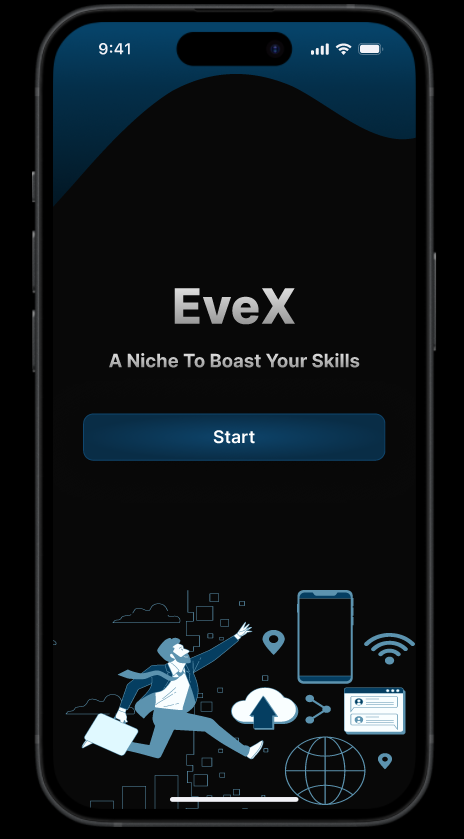
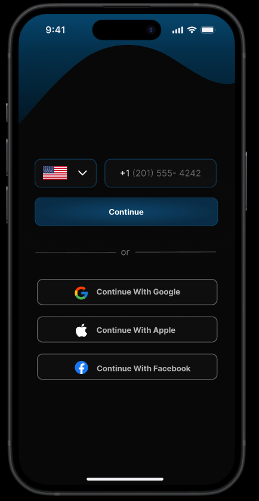
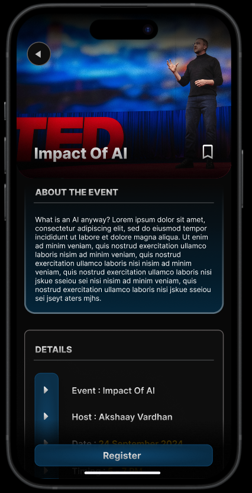
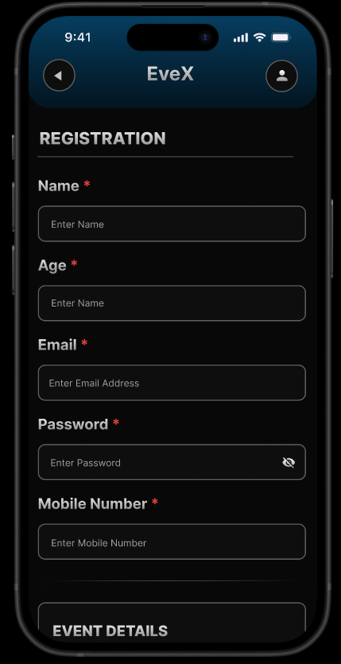
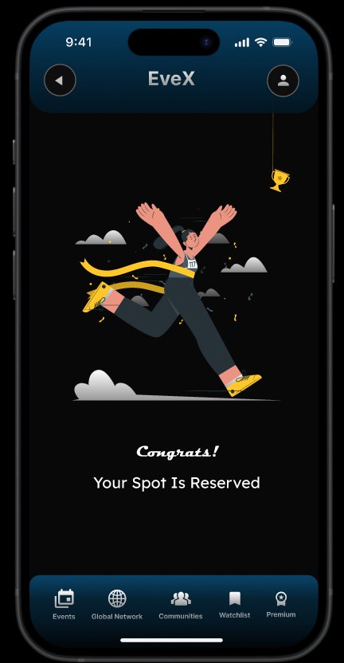

# Ex09 Event Registration Web Application
## Date:

## AIM:
To design, develop and deploy a web application for event registration.

## DESIGN STEPS:

### Step 1:
Create a new frame.

### Step 2:
Select any one preset size of your choice.

### Step 3:
Select the shapes you need.

### Step 4:
Import images as needed.

### Step 5:
Create pages based on your need and link them.

### Step 6:

Validate the HTML and CSS code.

### Step 6:

Publish the website in the given URL.

## DESIGN TOOL:
Figma

## CODE:
```
page 1
<div style="width: 100%; height: 100%; position: relative; background: #080808; border-radius: 30px; overflow: hidden">
    <div style="width: 454px; height: 251.66px; left: -62px; top: 615px; position: absolute">
        <div style="width: 452.20px; height: 241.50px; left: 0px; top: 10.16px; position: absolute; opacity: 0">
            <div style="width: 452.20px; height: 241.50px; left: 0px; top: 0px; position: absolute; background: #053E61"></div>
            <div style="width: 452.20px; height: 241.50px; left: 0px; top: 0px; position: absolute; opacity: 0.70; background: #F9FEFF"></div>
        </div>
        <div style="width: 165.17px; height: 50.82px; left: 32.82px; top: 200.28px; position: absolute">
            <div style="width: 25.49px; height: 50.82px; left: 139.68px; top: 0px; position: absolute; background: #5C93AF"></div>
            <div style="width: 25.50px; height: 39.19px; left: 104.76px; top: 11.63px; position: absolute; background: #5C93AF"></div>
            <div style="width: 25.47px; height: 23.11px; left: 69.84px; top: 27.71px; position: absolute; background: #5C93AF"></div>
            <div style="width: 25.50px; height: 8.57px; left: 34.92px; top: 42.25px; position: absolute; background: #5C93AF"></div>
            <div style="width: 25.50px; height: 4.27px; left: 0px; top: 46.55px; position: absolute; background: #5C93AF"></div>
        </div>
        <div style="width: 66.64px; height: 50.89px; left: 377.15px; top: 105.41px; position: absolute">
            <div style="width: 63.97px; height: 47.77px; left: 2.35px; top: 2.86px; position: absolute; background: #5C93AF"></div>
            <div style="width: 64.61px; height: 48.31px; left: 2.03px; top: 2.59px; position: absolute; background: #5C93AF"></div>
            <div style="width: 63.97px; height: 47.77px; left: 0.32px; top: 0.27px; position: absolute; background: #F9FEFF"></div>
            <div style="width: 64.62px; height: 48.31px; left: 0px; top: 0.01px; position: absolute; background: #5C93AF"></div>
            <div style="width: 63.97px; height: 6.05px; left: 0.32px; top: 0.27px; position: absolute; background: #053E61"></div>
            <div style="width: 64.62px; height: 6.59px; left: 0px; top: 0px; position: absolute; background: #5C93AF"></div>
            <div style="width: 3.42px; height: 2.91px; left: 45.70px; top: 1.99px; position: absolute; background: #F9FEFF"></div>
            <div style="width: 4.08px; height: 3.46px; left: 45.35px; top: 1.70px; position: absolute; background: #5C93AF"></div>
            <div style="width: 3.42px; height: 2.91px; left: 51.13px; top: 2px; position: absolute; background: #F9FEFF"></div>
            <div style="width: 4.08px; height: 3.46px; left: 50.80px; top: 1.70px; position: absolute; background: #5C93AF"></div>
            <div style="width: 3.42px; height: 2.91px; left: 56.55px; top: 1.99px; position: absolute; background: #F9FEFF"></div>
            <div style="width: 4.08px; height: 3.46px; left: 56.25px; top: 1.70px; position: absolute; background: #5C93AF"></div>
            <div style="width: 50.93px; height: 17.71px; left: 7.22px; top: 9.32px; position: absolute; background: #5C93AF"></div>
            <div style="width: 50.93px; height: 17.71px; left: 7.22px; top: 28.40px; position: absolute; background: #5C93AF"></div>
            <div style="width: 8.56px; height: 7.27px; left: 11.91px; top: 11.86px; position: absolute; background: #053E61"></div>
            <div style="width: 9.20px; height: 7.82px; left: 11.59px; top: 11.59px; position: absolute; background: #5C93AF"></div>
            <div style="width: 3.56px; height: 3.03px; left: 14.41px; top: 12.92px; position: absolute; background: #F9FEFF"></div>
            <div style="width: 4.20px; height: 3.57px; left: 14.09px; top: 12.65px; position: absolute; background: #5C93AF"></div>
            <div style="width: 5.01px; height: 2.71px; left: 13.69px; top: 16.42px; position: absolute; background: #F9FEFF"></div>
            <div style="width: 5.65px; height: 3.26px; left: 13.37px; top: 16.15px; position: absolute; background: #5C93AF"></div>
            <div style="width: 14.54px; height: 0.54px; left: 23.51px; top: 12.20px; position: absolute; background: #5C93AF"></div>
            <div style="width: 30px; height: 0.54px; left: 23.81px; top: 15.72px; position: absolute; background: #5C93AF"></div>
            <div style="width: 30px; height: 0.54px; left: 23.81px; top: 17.95px; position: absolute; background: #5C93AF"></div>
            <div style="width: 8.56px; height: 7.27px; left: 11.91px; top: 31.33px; position: absolute; background: #5C93AF"></div>
            <div style="width: 9.20px; height: 7.82px; left: 11.59px; top: 31.06px; position: absolute; background: #5C93AF"></div>
            <div style="width: 3.56px; height: 3.03px; left: 14.41px; top: 32.40px; position: absolute; background: #F9FEFF"></div>
            <div style="width: 4.22px; height: 3.58px; left: 14.08px; top: 32.12px; position: absolute; background: #5C93AF"></div>
            <div style="width: 5.01px; height: 2.71px; left: 13.69px; top: 35.89px; position: absolute; background: #F9FEFF"></div>
            <div style="width: 5.65px; height: 3.25px; left: 13.37px; top: 35.63px; position: absolute; background: #5C93AF"></div>
            <div style="width: 14.54px; height: 0.54px; left: 23.51px; top: 31.67px; position: absolute; background: #5C93AF"></div>
            <div style="width: 30px; height: 0.54px; left: 23.81px; top: 35.19px; position: absolute; background: #5C93AF"></div>
            <div style="width: 30px; height: 0.54px; left: 23.81px; top: 37.42px; position: absolute; background: #5C93AF"></div>
        </div>
        <div style="width: 55.01px; height: 34.05px; left: 398.99px; top: 46.45px; position: absolute">
            <div style="width: 55.01px; height: 14.10px; left: 0px; top: 0px; position: absolute; background: #5C93AF"></div>
            <div style="width: 39.75px; height: 11.15px; left: 7.59px; top: 8.49px; position: absolute; background: #5C93AF"></div>
            <div style="width: 24.34px; height: 8.08px; left: 15.38px; top: 16.99px; position: absolute; background: #5C93AF"></div>
            <div style="width: 10px; height: 8.49px; left: 22.50px; top: 25.56px; position: absolute; background: #5C93AF"></div>
        </div>
        <div style="width: 87.21px; height: 74.10px; left: 313.26px; top: 158.41px; position: absolute">
            <div style="width: 87.16px; height: 74.03px; left: 0.03px; top: 0.07px; position: absolute; background: #5C93AF"></div>
            <div style="width: 43.79px; height: 74.03px; left: 21.71px; top: 0.07px; position: absolute; background: #5C93AF"></div>
            <div style="width: 60.79px; height: 11.38px; left: 13.41px; top: 10.40px; position: absolute; background: #5C93AF"></div>
            <div style="width: 61.09px; height: 11.56px; left: 12.84px; top: 52.30px; position: absolute; background: #5C93AF"></div>
            <div style="width: 87.21px; height: 1.09px; left: 0px; top: 36.49px; position: absolute; background: #5C93AF"></div>
            <div style="width: 1.28px; height: 74.10px; left: 42.96px; top: -0px; position: absolute; background: #5C93AF"></div>
        </div>
        <div style="width: 27.50px; height: 31.12px; left: 335.53px; top: 113.38px; position: absolute; background: #5C93AF"></div>
        <div style="width: 140.16px; height: 150.62px; left: 289.12px; top: 43.13px; position: absolute">
            <div style="width: 23.35px; height: 26.59px; left: 0.32px; top: 0.06px; position: absolute; background: #5C93AF"></div>
            <div style="width: 23.99px; height: 26.92px; left: 0px; top: 0px; position: absolute; background: #5C93AF"></div>
            <div style="width: 14.72px; height: 16.79px; left: 125.10px; top: 133.58px; position: absolute; background: #5C93AF"></div>
            <div style="width: 15.38px; height: 17.32px; left: 124.78px; top: 133.30px; position: absolute; background: #5C93AF"></div>
        </div>
        <div style="width: 61.30px; height: 101.32px; left: 326.32px; top: -0px; position: absolute">
            <div style="width: 56.52px; height: 97.18px; left: 2.25px; top: 2.06px; position: absolute; background: #5C93AF"></div>
            <div style="width: 55.87px; height: 6.64px; left: 2.57px; top: 2.33px; position: absolute; background: #053E61"></div>
            <div style="width: 56.53px; height: 7.19px; left: 2.24px; top: 2.06px; position: absolute; background: #5C93AF"></div>
            <div style="width: 60.66px; height: 100.75px; left: 0.32px; top: 0.27px; position: absolute; background: #5C93AF"></div>
            <div style="width: 61.30px; height: 101.32px; left: 0px; top: 0px; position: absolute; background: #5C93AF"></div>
            <div style="width: 55.88px; height: 6.06px; left: 2.56px; top: 92.90px; position: absolute; background: #053E61"></div>
            <div style="width: 56.52px; height: 6.61px; left: 2.25px; top: 92.63px; position: absolute; background: #5C93AF"></div>
        </div>
        <div style="width: 72.72px; height: 45.75px; left: 255.05px; top: 105.26px; position: absolute">
            <div style="width: 70.06px; height: 37.12px; left: 2.34px; top: 2.23px; position: absolute; background: #5C93AF"></div>
            <div style="width: 70.75px; height: 37.62px; left: 1.97px; top: 1.99px; position: absolute; background: #5C93AF"></div>
            <div style="width: 70.11px; height: 37.07px; left: 0.31px; top: 0.31px; position: absolute; background: #F9FEFF"></div>
            <div style="width: 70.75px; height: 37.65px; left: 0px; top: 0px; position: absolute; background: #5C93AF"></div>
            <div style="width: 29.11px; height: 35.08px; left: 21.50px; top: 10.40px; position: absolute; background: #5C93AF"></div>
            <div style="width: 29.75px; height: 35.62px; left: 21.17px; top: 10.13px; position: absolute; background: #5C93AF"></div>
            <div style="width: 29.11px; height: 35.08px; left: 20.18px; top: 9.28px; position: absolute; background: #053E61"></div>
            <div style="width: 29.76px; height: 35.63px; left: 19.84px; top: 9px; position: absolute; background: #5C93AF"></div>
        </div>
        <div style="width: 182.26px; height: 193.15px; left: 17.87px; top: 14.50px; position: absolute">
            <div style="width: 73.27px; height: 9.20px; left: 108.99px; top: 11.85px; position: absolute; background: #5C93AF"></div>
            <div style="width: 38.33px; height: 10.61px; left: 130.42px; top: 0px; position: absolute; background: #5C93AF"></div>
            <div style="width: 26.07px; height: 12.97px; left: 22.14px; top: 31.99px; position: absolute; background: #5C93AF"></div>
            <div style="width: 25.72px; height: 10.37px; left: 3.63px; top: 34.58px; position: absolute; background: #5C93AF"></div>
            <div style="width: 44.56px; height: 12.96px; left: -0px; top: 180.19px; position: absolute; background: #5C93AF"></div>
            <div style="width: 74.96px; height: 21.53px; left: 58.21px; top: 98.21px; position: absolute; background: #5C93AF"></div>
        </div>
        <div style="width: 89.09px; height: 251.26px; left: 206.08px; top: 0.19px; position: absolute">
            <div style="width: 18.32px; height: 15.56px; left: 11.29px; top: 17.27px; position: absolute; background: #5C93AF"></div>
            <div style="width: 9.21px; height: 7.83px; left: 37.55px; top: 31.37px; position: absolute; background: #5C93AF"></div>
            <div style="width: 6px; height: 5.10px; left: 23.62px; top: 46.85px; position: absolute; background: #5C93AF"></div>
            <div style="width: 4.39px; height: 3.73px; left: 36.48px; top: 50.49px; position: absolute; background: #5C93AF"></div>
            <div style="width: 4.93px; height: 4.19px; left: 35.32px; top: 171.63px; position: absolute; background: #5C93AF"></div>
            <div style="width: 6.54px; height: 5.55px; left: 82.55px; top: 92.36px; position: absolute; background: #5C93AF"></div>
            <div style="width: 6px; height: 5.10px; left: 34.33px; top: 105.56px; position: absolute; background: #5C93AF"></div>
            <div style="width: 12.43px; height: 10.56px; left: 16.20px; top: 120.66px; position: absolute; background: #5C93AF"></div>
            <div style="width: 5.47px; height: 4.64px; left: 52.01px; top: 159.72px; position: absolute; background: #5C93AF"></div>
            <div style="width: 15.11px; height: 12.84px; left: 8.61px; top: 199.31px; position: absolute; background: #5C93AF"></div>
            <div style="width: 8.15px; height: 6.90px; left: 40.76px; top: 221.17px; position: absolute; background: #5C93AF"></div>
            <div style="width: 11.36px; height: 9.65px; left: 17.19px; top: 181.10px; position: absolute; background: #5C93AF"></div>
            <div style="width: 6px; height: 5.10px; left: 36.48px; top: 197.49px; position: absolute; background: #5C93AF"></div>
            <div style="width: 6px; height: 5.10px; left: 22.55px; top: 222.07px; position: absolute; background: #5C93AF"></div>
            <div style="width: 7.63px; height: 6.46px; left: 50.94px; top: 215.24px; position: absolute; background: #5C93AF"></div>
            <div style="width: 3.85px; height: 3.27px; left: 82.03px; top: 221.62px; position: absolute; background: #5C93AF"></div>
            <div style="width: 6px; height: 5.10px; left: 61.13px; top: 236.17px; position: absolute; background: #5C93AF"></div>
            <div style="width: 4.93px; height: 4.19px; left: 84.16px; top: 171.09px; position: absolute; background: #5C93AF"></div>
            <div style="width: 6px; height: 5.10px; left: 57.93px; top: 11.80px; position: absolute; background: #5C93AF"></div>
            <div style="width: 10.29px; height: 8.71px; left: 25.76px; top: 3.64px; position: absolute; background: #5C93AF"></div>
            <div style="width: 18.57px; height: 251.26px; left: 0px; top: 0px; position: absolute; background: #5C93AF"></div>
        </div>
        <div style="width: 196.65px; height: 148.67px; left: 93.48px; top: 34.35px; position: absolute">
            <div style="width: 25.49px; height: 18.69px; left: 0.33px; top: 117.86px; position: absolute; background: #F9FEFF"></div>
            <div style="width: 26.17px; height: 19.23px; left: 0px; top: 117.59px; position: absolute; background: #5C93AF"></div>
            <div style="width: 19.55px; height: 18.69px; left: 0.33px; top: 117.86px; position: absolute; background: #F9FEFF"></div>
            <div style="width: 20.22px; height: 19.24px; left: 0px; top: 117.59px; position: absolute; background: #5C93AF"></div>
            <div style="width: 14.96px; height: 18.46px; left: 0.33px; top: 117.91px; position: absolute; background: #F9FEFF"></div>
            <div style="width: 15.60px; height: 19.01px; left: 0.01px; top: 117.60px; position: absolute; background: #5C93AF"></div>
            <div style="width: 19.36px; height: 19.87px; left: 176.97px; top: 128.54px; position: absolute; background: #F9FEFF"></div>
            <div style="width: 19.98px; height: 20.42px; left: 176.67px; top: 128.25px; position: absolute; background: #5C93AF"></div>
            <div style="width: 13.46px; height: 19.87px; left: 182.90px; top: 128.53px; position: absolute; background: #F9FEFF"></div>
            <div style="width: 14.10px; height: 20.42px; left: 182.55px; top: 128.25px; position: absolute; background: #5C93AF"></div>
            <div style="width: 65.35px; height: 42.59px; left: 57.66px; top: 61.74px; position: absolute; background: #5C93AF"></div>
            <div style="width: 65.99px; height: 43.13px; left: 57.31px; top: 61.47px; position: absolute; background: #5C93AF"></div>
            <div style="width: 160.46px; height: 54.79px; left: 21.46px; top: 92.62px; position: absolute; background: #5C93AF"></div>
            <div style="width: 161.06px; height: 55.34px; left: 21.17px; top: 92.33px; position: absolute; background: #5C93AF"></div>
            <div style="width: 38.59px; height: 47.85px; left: 79.01px; top: 48px; position: absolute; background: #F9FEFF"></div>
            <div style="width: 39.20px; height: 48.39px; left: 78.71px; top: 47.71px; position: absolute; background: #5C93AF"></div>
            <div style="width: 2.37px; height: 1.65px; left: 99.81px; top: 75.76px; position: absolute; background: #5C93AF"></div>
            <div style="width: 19.08px; height: 12.01px; left: 79.77px; top: 77.91px; position: absolute; background: #5C93AF"></div>
            <div style="width: 14.88px; height: 12.49px; left: 87.11px; top: 71.01px; position: absolute; background: #5C93AF"></div>
            <div style="width: 11.31px; height: 3px; left: 88.50px; top: 89.30px; position: absolute; background: #5C93AF"></div>
            <div style="width: 4.07px; height: 1.34px; left: 101.23px; top: 88.03px; position: absolute; background: #5C93AF"></div>
            <div style="width: 16.81px; height: 16.12px; left: 167.43px; top: 0.23px; position: absolute; background: #F9FEFF"></div>
            <div style="width: 17.43px; height: 16.66px; left: 167.11px; top: 0px; position: absolute; background: #5C93AF"></div>
            <div style="width: 9.89px; height: 8.14px; left: 170.47px; top: 7.18px; position: absolute; background: #F9FEFF"></div>
            <div style="width: 10.56px; height: 8.68px; left: 170.15px; top: 6.91px; position: absolute; background: #5C93AF"></div>
            <div style="width: 7.89px; height: 7.08px; left: 164.38px; top: 12.45px; position: absolute; background: #F9FEFF"></div>
            <div style="width: 8.53px; height: 7.63px; left: 164.06px; top: 12.18px; position: absolute; background: #5C93AF"></div>
            <div style="width: 60.34px; height: 73.60px; left: 109.37px; top: 15.13px; position: absolute; background: #053E61"></div>
            <div style="width: 60.96px; height: 74.13px; left: 109.05px; top: 14.88px; position: absolute; background: #5C93AF"></div>
            <div style="width: 1.49px; height: 2.02px; left: 116.80px; top: 63.74px; position: absolute; background: #5C93AF"></div>
            <div style="width: 5.26px; height: 18.03px; left: 112.24px; top: 45.47px; position: absolute; background: #5C93AF"></div>
            <div style="width: 1.62px; height: 2.48px; left: 127.59px; top: 38.52px; position: absolute; background: #5C93AF"></div>
            <div style="width: 7.17px; height: 13.36px; left: 120.13px; top: 42.14px; position: absolute; background: #5C93AF"></div>
            <div style="width: 12.53px; height: 8.51px; left: 99.15px; top: 50.65px; position: absolute; background: #5C93AF"></div>
            <div style="width: 13.17px; height: 9.03px; left: 98.83px; top: 50.43px; position: absolute; background: #5C93AF"></div>
            <div style="width: 26.35px; height: 32.28px; left: 90.21px; top: 22.96px; position: absolute; background: #F9FEFF"></div>
            <div style="width: 26.98px; height: 32.81px; left: 89.90px; top: 22.70px; position: absolute; background: #5C93AF"></div>
            <div style="width: 1.59px; height: 1.94px; left: 107.72px; top: 29.02px; position: absolute; background: #5C93AF"></div>
            <div style="width: 2.92px; height: 2.13px; left: 105.59px; top: 27.05px; position: absolute; background: #5C93AF"></div>
            <div style="width: 35.60px; height: 27.10px; left: 82.08px; top: 17.61px; position: absolute; background: #5C93AF"></div>
            <div style="width: 36.28px; height: 27.60px; left: 81.73px; top: 17.34px; position: absolute; background: #5C93AF"></div>
            <div style="width: 4.59px; height: 1.14px; left: 110.51px; top: 37.32px; position: absolute; background: #F9FEFF"></div>
            <div style="width: 57.10px; height: 50.09px; left: 40.98px; top: 44.96px; position: absolute; background: #053E61"></div>
            <div style="width: 57.78px; height: 50.61px; left: 40.69px; top: 44.71px; position: absolute; background: #5C93AF"></div>
            <div style="width: 1.02px; height: 7.43px; left: 75.39px; top: 59.66px; position: absolute; background: #5C93AF"></div>
            <div style="width: 1.80px; height: 2.19px; left: 88.50px; top: 70.16px; position: absolute; background: #5C93AF"></div>
            <div style="width: 5.49px; height: 22.57px; left: 90.13px; top: 46.92px; position: absolute; background: #5C93AF"></div>
            <div style="width: 8.54px; height: 6.17px; left: 39.66px; top: 92.18px; position: absolute; background: #F9FEFF"></div>
            <div style="width: 9.19px; height: 6.70px; left: 39.34px; top: 91.92px; position: absolute; background: #5C93AF"></div>
            <div style="width: 14.51px; height: 8.97px; left: 34.45px; top: 101.59px; position: absolute; background: #5C93AF"></div>
            <div style="width: 15.13px; height: 9.49px; left: 34.13px; top: 101.34px; position: absolute; background: #5C93AF"></div>
            <div style="width: 47.07px; height: 33.56px; left: 19.28px; top: 98.02px; position: absolute; transform: rotate(23.94deg); transform-origin: 0 0; background: #E0F9FF"></div>
            <div style="width: 58.55px; height: 45.93px; left: 2.71px; top: 98.89px; position: absolute; background: #5C93AF"></div>
            <div style="width: 12.80px; height: 13.94px; left: 36.77px; top: 95.67px; position: absolute; background: #F9FEFF"></div>
            <div style="width: 13.39px; height: 14.46px; left: 36.49px; top: 95.44px; position: absolute; background: #5C93AF"></div>
            <div style="width: 12.64px; height: 15.01px; left: 92.84px; top: 43.62px; position: absolute; background: #F9FEFF"></div>
            <div style="width: 13.28px; height: 15.55px; left: 92.50px; top: 43.36px; position: absolute; background: #5C93AF"></div>
            <div style="width: 3.05px; height: 8.31px; left: 109.33px; top: 48.81px; position: absolute; background: #F9FEFF"></div>
            <div style="width: 3.69px; height: 8.85px; left: 109.03px; top: 48.53px; position: absolute; background: #5C93AF"></div>
            <div style="width: 66.23px; height: 11.82px; left: 39.34px; top: 51.88px; position: absolute; background: #5C93AF"></div>
            <div style="width: 66.88px; height: 12.36px; left: 39px; top: 51.61px; position: absolute; background: #5C93AF"></div>
        </div>
    </div>
    <div style="height: 198px; left: 34px; top: 276px; position: absolute; flex-direction: column; justify-content: flex-start; align-items: center; gap: 46px; display: inline-flex">
        <div style="height: 103px; flex-direction: column; justify-content: flex-start; align-items: center; gap: 15px; display: flex">
            <div style="align-self: stretch; text-align: center; color: #F4F4F4; font-size: 53.06px; font-family: Inter; font-weight: 800; word-wrap: break-word">EveX</div>
            <div style="align-self: stretch"><span style="color: #F4F4F4; font-size: 20px; font-family: Inter; font-weight: 700; word-wrap: break-word">A Niche</span><span style="color: #F4F4F4; font-size: 20px; font-family: Inter; font-weight: 700; text-transform: capitalize; word-wrap: break-word"> to boast your skills</span></div>
        </div>
        <div style="align-self: stretch; height: 49px; padding-top: 7px; padding-bottom: 7px; background: radial-gradient(100.00% 100.00% at NaN% Infinity%, rgba(15.90, 91.60, 145.68, 0.72) 0%, rgba(10.39, 59.86, 95.19, 0.72) 100%); box-shadow: 0px 4px 45px rgba(0, 0, 0, 0.25); border-radius: 10px; border: 1px #0F466E solid; justify-content: center; align-items: center; gap: 10px; display: inline-flex">
            <div style="color: white; font-size: 19px; font-family: Inter; font-weight: 600; text-transform: capitalize; word-wrap: break-word">Start</div>
        </div>
    </div>
    <div style="width: 520px; height: 201px; left: 0px; top: 201px; position: absolute; background: linear-gradient(180deg, #021623 0%, #032235 29%, #042F4A 65%, #064369 96%)"></div>
    <div style="width: 393px; height: 54px; left: -3px; top: 0px; position: absolute; justify-content: center; align-items: flex-start; gap: 112px; display: inline-flex">
        <div style="height: 54px; padding-top: 18.34px; padding-bottom: 13.66px; justify-content: center; align-items: center; display: inline-flex">
            <div style="text-align: center; color: #F2F2F7; font-size: 17px; font-family: SF Pro; font-weight: 590; line-height: 22px; word-wrap: break-word">9:41</div>
        </div>
        <div style="width: 140.50px; height: 54px; position: relative; flex-direction: column; justify-content: flex-start; align-items: flex-start; display: flex">
            <div style="width: 27.33px; height: 13px; position: relative">
                <div style="width: 25px; height: 13px; left: 0px; top: 0px; position: absolute; opacity: 0.35; border-radius: 4.30px; border: 1px #F2F2F7 solid"></div>
                <div style="width: 1.33px; height: 4.08px; left: 26px; top: 4.78px; position: absolute; opacity: 0.40; background: #F2F2F7"></div>
                <div style="width: 21px; height: 9px; left: 2px; top: 2px; position: absolute; background: #F2F2F7; border-radius: 2.50px"></div>
            </div>
            <div style="width: 19.20px; height: 12.23px; background: #F2F2F7"></div>
            <div style="width: 17.14px; height: 12.33px; background: #F2F2F7"></div>
        </div>
    </div>
    <div style="width: 393px; height: 21px; padding-left: 127px; padding-right: 127px; left: 0px; top: 831px; position: absolute; justify-content: center; align-items: center; display: inline-flex">
        <div style="width: 139px; height: 5px; transform: rotate(180deg); transform-origin: 0 0; background: #F2F2F7; border-radius: 100px"></div>
    </div>
</div>


page 2

<div style="width: 100%; height: 100%; position: relative; background: #080808; border-radius: 30px; overflow: hidden">
    <div style="width: 520px; height: 201px; left: 0px; top: 201px; position: absolute; background: linear-gradient(180deg, #021623 0%, #032235 29%, #042F4A 65%, #064369 96%)"></div>
    <div style="width: 393px; height: 54px; left: -3px; top: 0px; position: absolute; justify-content: center; align-items: flex-start; gap: 112px; display: inline-flex">
        <div style="height: 54px; padding-top: 18.34px; padding-bottom: 13.66px; justify-content: center; align-items: center; display: inline-flex">
            <div style="text-align: center; color: #F2F2F7; font-size: 17px; font-family: SF Pro; font-weight: 590; line-height: 22px; word-wrap: break-word">9:41</div>
        </div>
        <div style="width: 140.50px; height: 54px; position: relative; flex-direction: column; justify-content: flex-start; align-items: flex-start; display: flex">
            <div style="width: 27.33px; height: 13px; position: relative">
                <div style="width: 25px; height: 13px; left: 0px; top: 0px; position: absolute; opacity: 0.35; border-radius: 4.30px; border: 1px #F2F2F7 solid"></div>
                <div style="width: 1.33px; height: 4.08px; left: 26px; top: 4.78px; position: absolute; opacity: 0.40; background: #F2F2F7"></div>
                <div style="width: 21px; height: 9px; left: 2px; top: 2px; position: absolute; background: #F2F2F7; border-radius: 2.50px"></div>
            </div>
            <div style="width: 19.20px; height: 12.23px; background: #F2F2F7"></div>
            <div style="width: 17.14px; height: 12.33px; background: #F2F2F7"></div>
        </div>
    </div>
    <div style="height: 397.96px; left: 31px; top: 264px; position: absolute; flex-direction: column; justify-content: flex-start; align-items: flex-end; gap: 39px; display: inline-flex">
        <div style="align-self: stretch; height: 176.77px; flex-direction: column; justify-content: flex-start; align-items: flex-start; gap: 39px; display: flex">
            <div style="align-self: stretch; height: 118.77px; flex-direction: column; justify-content: flex-start; align-items: flex-start; gap: 30.20px; display: flex">
                <div style="align-self: stretch; height: 118.77px; flex-direction: column; justify-content: flex-start; align-items: flex-start; gap: 20.13px; display: flex">
                    <div style="align-self: stretch; justify-content: flex-start; align-items: center; gap: 17.11px; display: inline-flex">
                        <div style="flex: 1 1 0; align-self: stretch; padding-top: 3.02px; padding-bottom: 5.12px; padding-left: 12.08px; padding-right: 4.03px; background: #0E0E0E; box-shadow: 0px 4.026200771331787px 5.032751560211182px rgba(0, 0, 0, 0.25); border-radius: 10.07px; border: 1.51px rgba(15, 70, 110, 0.72) solid; justify-content: flex-end; align-items: center; gap: 6.04px; display: flex">
                            
                            <div style="width: 40.26px; align-self: stretch; padding: 10.07px; flex-direction: column; justify-content: center; align-items: center; gap: 10.07px; display: inline-flex">
                                <div style="align-self: stretch; color: white; font-size: 18.01px; font-family: SF Pro Text; font-weight: 500; word-wrap: break-word">􀆈</div>
                            </div>
                        </div>
                        <div style="height: 49.20px; padding-left: 12.08px; padding-right: 12.08px; padding-top: 15.10px; padding-bottom: 15.10px; background: #0E0E0E; box-shadow: 0px 4.026200771331787px 5.032751560211182px rgba(0, 0, 0, 0.25); border-radius: 10.07px; border: 1.50px rgba(15.26, 70.31, 109.64, 0.72) solid; justify-content: center; align-items: center; gap: 10.07px; display: flex">
                            <div><span style="color: #F6F6F6; font-size: 16.10px; font-family: Inter; font-weight: 400; word-wrap: break-word">+1 </span><span style="color: #686868; font-size: 16.10px; font-family: Inter; font-weight: 400; word-wrap: break-word">(201) 555- 4242</span></div>
                        </div>
                    </div>
                    <div style="align-self: stretch; height: 49.32px; padding-top: 7.05px; padding-bottom: 7.05px; background: radial-gradient(100.00% 100.00% at NaN% Infinity%, rgba(15.90, 91.60, 145.68, 0.72) 0%, rgba(10.39, 59.86, 95.19, 0.72) 100%); box-shadow: 0px 4.026200771331787px 45.294761657714844px rgba(0, 0, 0, 0.25); border-radius: 10.07px; border: 1.01px #0F466E solid; justify-content: center; align-items: center; gap: 10.07px; display: inline-flex">
                        <div style="color: white; font-size: 14.09px; font-family: Inter; font-weight: 700; text-transform: capitalize; word-wrap: break-word">Continue</div>
                    </div>
                </div>
            </div>
            <div style="width: 327.13px; position: relative">
                <div style="width: 145.95px; height: 0px; left: 181.18px; top: 9.59px; position: absolute; box-shadow: 0px 4.026200771331787px 6.03930139541626px rgba(0, 0, 0, 0.25); border: 1.51px rgba(87.70, 90.63, 92.64, 0.65) solid"></div>
                <div style="width: 145.95px; height: 0px; left: 0px; top: 10.59px; position: absolute; box-shadow: 0px 4.026200771331787px 6.03930139541626px rgba(0, 0, 0, 0.25); border: 1.51px rgba(87.70, 90.63, 92.64, 0.65) solid"></div>
                <div style="left: 155.01px; top: 0px; position: absolute; color: rgba(153, 153, 153, 0.78); font-size: 16.10px; font-family: Inter; font-weight: 400; word-wrap: break-word">or</div>
            </div>
        </div>
        <div style="width: 327.13px; height: 182.19px; position: relative">
            <div style="width: 327.13px; height: 47.31px; padding-left: 20.13px; left: 0px; top: 0px; position: absolute; background: #0E0E0E; border-radius: 10.07px; border: 1.51px #FFF3F3 solid"></div>
            <div style="width: 327.13px; height: 47.31px; padding-left: 20.13px; left: 0px; top: 67.44px; position: absolute; background: #0E0E0E; border-radius: 10.07px; border: 1.51px #FFF3F3 solid"></div>
            <div style="width: 327.13px; height: 47.31px; padding-left: 20.13px; left: 0px; top: 134.88px; position: absolute; background: #0E0E0E; border-radius: 10.07px; border: 1.51px #FFF3F3 solid"></div>
            <div style="width: 210.37px; height: 161.60px; left: 68.45px; top: 12.08px; position: absolute; justify-content: flex-start; align-items: center; gap: 15.10px; display: inline-flex">
                <div style="width: 24.16px; flex-direction: column; justify-content: flex-start; align-items: flex-start; gap: 43.28px; display: inline-flex">
                    <div style="width: 23.55px; height: 23.55px; position: relative">
                        <div style="width: 23.55px; height: 23.55px; left: 0px; top: 0px; position: absolute; background: #FFC107"></div>
                        <div style="width: 18.43px; height: 9.13px; left: 1.36px; top: -0px; position: absolute; background: #FF3D00"></div>
                        <div style="width: 18.38px; height: 9.39px; left: 1.29px; top: 14.16px; position: absolute; background: #4CAF50"></div>
                        <div style="width: 11.77px; height: 11.08px; left: 11.77px; top: 9.42px; position: absolute; background: #1976D2"></div>
                    </div>
                    <div style="width: 24.16px; height: 24.16px; position: relative; border-radius: 6.04px; overflow: hidden">
                        <div style="width: 20.53px; height: 24.16px; left: 1.81px; top: 0px; position: absolute; background: white"></div>
                    </div>
                    <div style="width: 24.16px; height: 24.16px; position: relative; background: #1877F2; border-radius: 50.33px; overflow: hidden">
                        <div style="width: 10.33px; height: 19.44px; left: 7.12px; top: 4.72px; position: absolute; background: white"></div>
                    </div>
                </div>
                <div style="width: 171.11px; flex-direction: column; justify-content: flex-start; align-items: flex-start; gap: 46.30px; display: inline-flex">
                    <div style="align-self: stretch; color: #B4B4B4; font-size: 14.09px; font-family: Inter; font-weight: 700; line-height: 22.14px; word-wrap: break-word">Continue With Google</div>
                    <div style="align-self: stretch; color: #B4B4B4; font-size: 14.09px; font-family: Inter; font-weight: 700; line-height: 22.14px; word-wrap: break-word">Continue With Apple</div>
                    <div style="align-self: stretch; text-align: center; color: #B4B4B4; font-size: 14.09px; font-family: Inter; font-weight: 700; line-height: 22.14px; word-wrap: break-word">Continue With Facebook</div>
                </div>
            </div>
        </div>
    </div>
    <div style="width: 393px; height: 21px; padding-left: 127px; padding-right: 127px; left: -3px; top: 831px; position: absolute; justify-content: center; align-items: center; display: inline-flex">
        <div style="width: 139px; height: 5px; transform: rotate(180deg); transform-origin: 0 0; background: #F2F2F7; border-radius: 100px"></div>
    </div>
</div>

page 3
<div style="width: 100%; height: 100%; position: relative; background: #080808; border-radius: 30px; overflow: hidden">
    <div style="width: 393px; height: 189px; left: 0px; top: 189px; position: absolute; opacity: 0.93; background: linear-gradient(180deg, rgba(1.94, 22.50, 35.28, 0.95) 0%, rgba(3.95, 47.23, 74.14, 0.95) 57%, rgba(5.53, 66.80, 104.89, 0.95) 96%); border-radius: 30px"></div>
    <div style="width: 393px; height: 54px; left: -3px; top: 0px; position: absolute; justify-content: center; align-items: flex-start; gap: 112px; display: inline-flex">
        <div style="height: 54px; padding-top: 18.34px; padding-bottom: 13.66px; justify-content: center; align-items: center; display: inline-flex">
            <div style="text-align: center; color: #F2F2F7; font-size: 17px; font-family: SF Pro; font-weight: 590; line-height: 22px; word-wrap: break-word">9:41</div>
        </div>
        <div style="width: 140.50px; height: 54px; position: relative; flex-direction: column; justify-content: flex-start; align-items: flex-start; display: flex">
            <div style="width: 27.33px; height: 13px; position: relative">
                <div style="width: 25px; height: 13px; left: 0px; top: 0px; position: absolute; opacity: 0.35; border-radius: 4.30px; border: 1px #F2F2F7 solid"></div>
                <div style="width: 1.33px; height: 4.08px; left: 26px; top: 4.78px; position: absolute; opacity: 0.40; background: #F2F2F7"></div>
                <div style="width: 21px; height: 9px; left: 2px; top: 2px; position: absolute; background: #F2F2F7; border-radius: 2.50px"></div>
            </div>
            <div style="width: 19.20px; height: 12.23px; background: #F2F2F7"></div>
            <div style="width: 17.14px; height: 12.33px; background: #F2F2F7"></div>
        </div>
    </div>
    <div style="height: 92px; left: 15px; top: 66px; position: absolute; flex-direction: column; justify-content: flex-start; align-items: flex-start; gap: 15px; display: inline-flex">
        <div style="align-self: stretch; justify-content: space-between; align-items: center; display: inline-flex">
            <div style="justify-content: flex-start; align-items: center; gap: 7px; display: flex">
                <div style="width: 25px; height: 25px; position: relative">
                    <div style="width: 15.62px; height: 0px; left: 4.69px; top: 8.33px; position: absolute; border: 1.56px white solid"></div>
                    <div style="width: 15.62px; height: 0px; left: 4.69px; top: 12.50px; position: absolute; border: 1.56px white solid"></div>
                    <div style="width: 15.62px; height: 0px; left: 4.69px; top: 16.67px; position: absolute; border: 1.56px white solid"></div>
                </div>
                <div style="color: #F4F4F4; font-size: 20.75px; font-family: Inter; font-weight: 700; word-wrap: break-word">EveX</div>
            </div>
            <div style="width: 36px; height: 36px; position: relative">
                <div style="width: 36px; height: 36px; left: 0px; top: 0px; position: absolute; background: #141414; border-radius: 9999px; border: 1px #FFF3F3 solid"></div>
                <div style="width: 14.73px; height: 14.73px; left: 10.64px; top: 10.64px; position: absolute; background: linear-gradient(180deg, white 0%, #999999 100%)"></div>
            </div>
        </div>
        <div style="width: 363px; padding-top: 8px; padding-bottom: 9px; padding-left: 8px; padding-right: 270px; background: #0E0E0E; border-radius: 10px; border: 1px #5F5F5F solid; justify-content: flex-start; align-items: center; gap: 18px; display: inline-flex">
            <div style="width: 24px; height: 24px; position: relative; flex-direction: column; justify-content: flex-start; align-items: flex-start; display: flex">
                <div style="width: 15.63px; height: 15.78px; background: #A1A1A1"></div>
            </div>
            <div style="color: rgba(255, 255, 255, 0.60); font-size: 13px; font-family: Inter; font-weight: 400; word-wrap: break-word">Search</div>
        </div>
    </div>
    <div style="height: 1018px; left: 14px; top: 298px; position: absolute; flex-direction: column; justify-content: flex-start; align-items: flex-start; gap: 30px; display: inline-flex">
        <div style="align-self: stretch; height: 232px; flex-direction: column; justify-content: flex-start; align-items: flex-start; gap: 15px; display: flex">
            <div style="align-self: stretch; color: #F4F4F4; font-size: 20px; font-family: Inter; font-weight: 700; word-wrap: break-word">COMPUTING</div>
            <div style="align-self: stretch; justify-content: flex-start; align-items: center; gap: 20px; display: inline-flex">
                <div style="width: 320px; height: 193px; position: relative; background: #0E0E0E; box-shadow: 0px 5px 12px rgba(0, 0, 0, 0.10); border-radius: 10px; overflow: hidden; border: 1.50px #FFF3F3 solid">
                    <div style="width: 179px; height: 162px; left: 199px; top: 54px; position: absolute; background: linear-gradient(146deg, #254D7E 0%, #1B6282 55%, #81A9A1 100%); box-shadow: 180px 180px 180px; border-radius: 9999px; filter: blur(180px)"></div>
                    
                    <div style="height: 93px; left: 15px; top: 15px; position: absolute; flex-direction: column; justify-content: flex-start; align-items: flex-start; gap: 11px; display: inline-flex">
                        <div style="align-self: stretch; color: white; font-size: 28px; font-family: Inter; font-weight: 700; word-wrap: break-word">30% OFF</div>
                        <div style="align-self: stretch; color: rgba(153, 153, 153, 0.78); font-size: 13px; font-family: Inter; font-weight: 400; word-wrap: break-word">Discover discounts in your favourite local restaurants.</div>
                    </div>
                    <div style="width: 109px; height: 29px; padding-left: 23px; padding-right: 23px; padding-top: 7px; padding-bottom: 7px; left: 15px; top: 135px; position: absolute; background: radial-gradient(100.00% 100.00% at NaN% Infinity%, rgba(15.90, 91.60, 145.68, 0.72) 0%, rgba(10.39, 59.86, 95.19, 0.72) 100%); border-radius: 10px; border: 1px #0F466E solid; justify-content: center; align-items: center; gap: 10px; display: inline-flex">
                        <div style="color: white; font-size: 12px; font-family: Inter; font-weight: 600; text-transform: capitalize; word-wrap: break-word">Check</div>
                    </div>
                    <div style="width: 320px; height: 25px; left: 0px; top: 168px; position: absolute; background: linear-gradient(180deg, rgba(0, 0, 0, 0) 0%, rgba(0, 0, 0, 0.40) 100%); border-top-left-radius: 10px; border-top-right-radius: 10px"></div>
                    <div style="width: 192.64px; height: 18.69px; left: 208.69px; top: 0px; position: absolute; transform: rotate(89.92deg); transform-origin: 0 0; background: rgba(0, 0, 0, 0.59); box-shadow: 15px 15px 15px; border-top-left-radius: 10px; filter: blur(15px)"></div>
                </div>
                <div style="width: 320px; height: 193px; position: relative; background: #0E0E0E; box-shadow: 0px 5px 12px rgba(0, 0, 0, 0.10); border-radius: 10px; overflow: hidden; border: 1.50px #FFF3F3 solid">
                    <div style="width: 179px; height: 162px; left: 199px; top: 54px; position: absolute; background: linear-gradient(146deg, #254F7E 0%, #196488 55%, #8EAFAA 100%); box-shadow: 180px 180px 180px; border-radius: 9999px; filter: blur(180px)"></div>
                    
                    <div style="height: 93px; left: 15px; top: 15px; position: absolute; flex-direction: column; justify-content: flex-start; align-items: flex-start; gap: 11px; display: inline-flex">
                        <div style="align-self: stretch; color: white; font-size: 28px; font-family: Inter; font-weight: 700; word-wrap: break-word">30% OFF</div>
                        <div style="align-self: stretch; color: rgba(153, 153, 153, 0.78); font-size: 13px; font-family: Inter; font-weight: 400; word-wrap: break-word">Discover discounts in your favourite local restaurants.</div>
                    </div>
                    <div style="width: 109px; height: 29px; padding-left: 23px; padding-right: 23px; padding-top: 7px; padding-bottom: 7px; left: 15px; top: 135px; position: absolute; background: radial-gradient(100.00% 100.00% at NaN% Infinity%, rgba(15.90, 91.60, 145.68, 0.72) 0%, rgba(10.39, 59.86, 95.19, 0.72) 100%); border-radius: 10px; border: 1px #0F466E solid; justify-content: center; align-items: center; gap: 10px; display: inline-flex">
                        <div style="color: white; font-size: 12px; font-family: Inter; font-weight: 600; text-transform: capitalize; word-wrap: break-word">Check</div>
                    </div>
                    <div style="width: 320px; height: 25px; left: 0px; top: 169px; position: absolute; background: linear-gradient(180deg, rgba(0, 0, 0, 0) 0%, rgba(0, 0, 0, 0.40) 100%); border-top-left-radius: 10px; border-top-right-radius: 10px"></div>
                    <div style="width: 192.64px; height: 23.52px; left: 191.03px; top: 0.21px; position: absolute; transform: rotate(89.92deg); transform-origin: 0 0; background: rgba(0, 0, 0, 0.50); box-shadow: 15px 15px 15px; border-top-left-radius: 10px; filter: blur(15px)"></div>
                </div>
            </div>
        </div>
        <div style="align-self: stretch; height: 232px; flex-direction: column; justify-content: flex-start; align-items: flex-start; gap: 15px; display: flex">
            <div style="align-self: stretch; color: #F4F4F4; font-size: 20px; font-family: Inter; font-weight: 700; word-wrap: break-word">NETWORKING </div>
            <div style="align-self: stretch; justify-content: flex-start; align-items: center; gap: 20px; display: inline-flex">
                <div style="width: 320px; height: 193px; position: relative; background: #0E0E0E; box-shadow: 0px 5px 12px rgba(0, 0, 0, 0.10); border-radius: 10px; overflow: hidden; border: 1.50px #FFF3F3 solid">
                    <div style="width: 179px; height: 162px; left: 199px; top: 54px; position: absolute; background: linear-gradient(146deg, #254D7E 0%, #1B6282 55%, #81A9A1 100%); box-shadow: 180px 180px 180px; border-radius: 9999px; filter: blur(180px)"></div>
                    
                    <div style="height: 93px; left: 15px; top: 15px; position: absolute; flex-direction: column; justify-content: flex-start; align-items: flex-start; gap: 11px; display: inline-flex">
                        <div style="align-self: stretch; color: white; font-size: 28px; font-family: Inter; font-weight: 700; word-wrap: break-word">30% OFF</div>
                        <div style="align-self: stretch; color: rgba(153, 153, 153, 0.78); font-size: 13px; font-family: Inter; font-weight: 400; word-wrap: break-word">Discover discounts in your favourite local restaurants.</div>
                    </div>
                    <div style="width: 109px; height: 29px; padding-left: 23px; padding-right: 23px; padding-top: 7px; padding-bottom: 7px; left: 15px; top: 135px; position: absolute; background: radial-gradient(100.00% 100.00% at NaN% Infinity%, rgba(15.90, 91.60, 145.68, 0.72) 0%, rgba(10.39, 59.86, 95.19, 0.72) 100%); border-radius: 10px; border: 1px #0F466E solid; justify-content: center; align-items: center; gap: 10px; display: inline-flex">
                        <div style="color: white; font-size: 12px; font-family: Inter; font-weight: 600; text-transform: capitalize; word-wrap: break-word">Check</div>
                    </div>
                    <div style="width: 320px; height: 25px; left: 0px; top: 168px; position: absolute; background: linear-gradient(180deg, rgba(0, 0, 0, 0) 0%, rgba(0, 0, 0, 0.40) 100%); border-top-left-radius: 10px; border-top-right-radius: 10px"></div>
                    <div style="width: 192.64px; height: 11.90px; left: 204.52px; top: 0px; position: absolute; transform: rotate(89.92deg); transform-origin: 0 0; background: rgba(0, 0, 0, 0.59); box-shadow: 15px 15px 15px; border-top-left-radius: 10px; filter: blur(15px)"></div>
                </div>
                <div style="width: 320px; height: 193px; position: relative; background: #0E0E0E; box-shadow: 0px 5px 12px rgba(0, 0, 0, 0.10); border-radius: 10px; overflow: hidden; border: 1.50px #FFF3F3 solid">
                    <div style="width: 179px; height: 162px; left: 199px; top: 54px; position: absolute; background: linear-gradient(146deg, #254F7E 0%, #196488 55%, #8EAFAA 100%); box-shadow: 180px 180px 180px; border-radius: 9999px; filter: blur(180px)"></div>
                    
                    <div style="height: 93px; left: 15px; top: 15px; position: absolute; flex-direction: column; justify-content: flex-start; align-items: flex-start; gap: 11px; display: inline-flex">
                        <div style="align-self: stretch; color: white; font-size: 28px; font-family: Inter; font-weight: 700; word-wrap: break-word">30% OFF</div>
                        <div style="align-self: stretch; color: rgba(153, 153, 153, 0.78); font-size: 13px; font-family: Inter; font-weight: 400; word-wrap: break-word">Discover discounts in your favourite local restaurants.</div>
                    </div>
                    <div style="width: 109px; height: 29px; padding-left: 23px; padding-right: 23px; padding-top: 7px; padding-bottom: 7px; left: 15px; top: 135px; position: absolute; background: radial-gradient(100.00% 100.00% at NaN% Infinity%, rgba(15.90, 91.60, 145.68, 0.72) 0%, rgba(10.39, 59.86, 95.19, 0.72) 100%); border-radius: 10px; border: 1px #0F466E solid; justify-content: center; align-items: center; gap: 10px; display: inline-flex">
                        <div style="color: white; font-size: 12px; font-family: Inter; font-weight: 600; text-transform: capitalize; word-wrap: break-word">Check</div>
                    </div>
                    <div style="width: 320px; height: 25px; left: 0px; top: 169px; position: absolute; background: linear-gradient(180deg, rgba(0, 0, 0, 0) 0%, rgba(0, 0, 0, 0.40) 100%); border-top-left-radius: 10px; border-top-right-radius: 10px"></div>
                </div>
            </div>
        </div>
        <div style="align-self: stretch; height: 232px; flex-direction: column; justify-content: flex-start; align-items: flex-start; gap: 15px; display: flex">
            <div style="align-self: stretch; color: #F4F4F4; font-size: 20px; font-family: Inter; font-weight: 700; word-wrap: break-word">CHARITY</div>
            <div style="align-self: stretch; justify-content: flex-start; align-items: center; gap: 20px; display: inline-flex">
                <div style="width: 320px; height: 193px; position: relative; background: #0E0E0E; box-shadow: 0px 5px 12px rgba(0, 0, 0, 0.10); border-radius: 10px; overflow: hidden; border: 1px #FFF3F3 solid">
                    <div style="width: 179px; height: 162px; left: 199px; top: 54px; position: absolute; background: linear-gradient(146deg, #254F7E 0%, #196488 55%, #8EAFAA 100%); box-shadow: 180px 180px 180px; border-radius: 9999px; filter: blur(180px)"></div>
                    
                    <div style="height: 93px; left: 15px; top: 15px; position: absolute; flex-direction: column; justify-content: flex-start; align-items: flex-start; gap: 11px; display: inline-flex">
                        <div style="align-self: stretch; color: white; font-size: 28px; font-family: Inter; font-weight: 700; word-wrap: break-word">30% OFF</div>
                        <div style="align-self: stretch; color: rgba(153, 153, 153, 0.78); font-size: 13px; font-family: Inter; font-weight: 400; word-wrap: break-word">Discover discounts in your favourite local restaurants.</div>
                    </div>
                    <div style="width: 109px; height: 29px; padding-left: 23px; padding-right: 23px; padding-top: 7px; padding-bottom: 7px; left: 15px; top: 135px; position: absolute; background: radial-gradient(100.00% 100.00% at NaN% Infinity%, rgba(15.90, 91.60, 145.68, 0.72) 0%, rgba(10.39, 59.86, 95.19, 0.72) 100%); border-radius: 10px; border: 1px #0F466E solid; justify-content: center; align-items: center; gap: 10px; display: inline-flex">
                        <div style="color: white; font-size: 12px; font-family: Inter; font-weight: 600; text-transform: capitalize; word-wrap: break-word">Check</div>
                    </div>
                    <div style="width: 320px; height: 25px; left: 0px; top: 169px; position: absolute; background: linear-gradient(180deg, rgba(0, 0, 0, 0) 0%, rgba(0, 0, 0, 0.40) 100%); border-top-left-radius: 10px; border-top-right-radius: 10px"></div>
                    <div style="width: 68.62px; height: 12.10px; left: 185.10px; top: 0px; position: absolute; transform: rotate(89.92deg); transform-origin: 0 0; background: rgba(0, 0, 0, 0.50); box-shadow: 15px 15px 15px; border-top-left-radius: 10px; filter: blur(15px)"></div>
                </div>
                <div style="width: 320px; height: 193px; position: relative; background: #0E0E0E; box-shadow: 0px 5px 12px rgba(0, 0, 0, 0.10); border-radius: 10px; overflow: hidden; border: 1.50px #FFF3F3 solid">
                    <div style="width: 179px; height: 162px; left: 199px; top: 54px; position: absolute; background: linear-gradient(146deg, #254D7E 0%, #1B6282 55%, #81A9A1 100%); box-shadow: 180px 180px 180px; border-radius: 9999px; filter: blur(180px)"></div>
                    
                    <div style="height: 93px; left: 15px; top: 15px; position: absolute; flex-direction: column; justify-content: flex-start; align-items: flex-start; gap: 11px; display: inline-flex">
                        <div style="align-self: stretch; color: white; font-size: 28px; font-family: Inter; font-weight: 700; word-wrap: break-word">30% OFF</div>
                        <div style="align-self: stretch; color: rgba(153, 153, 153, 0.78); font-size: 13px; font-family: Inter; font-weight: 400; word-wrap: break-word">Discover discounts in your favourite local restaurants.</div>
                    </div>
                    <div style="width: 109px; height: 29px; padding-left: 23px; padding-right: 23px; padding-top: 7px; padding-bottom: 7px; left: 15px; top: 135px; position: absolute; background: radial-gradient(100.00% 100.00% at NaN% Infinity%, rgba(15.90, 91.60, 145.68, 0.72) 0%, rgba(10.39, 59.86, 95.19, 0.72) 100%); border-radius: 10px; border: 1px #0F466E solid; justify-content: center; align-items: center; gap: 10px; display: inline-flex">
                        <div style="color: white; font-size: 12px; font-family: Inter; font-weight: 600; text-transform: capitalize; word-wrap: break-word">Check</div>
                    </div>
                    <div style="width: 320px; height: 25px; left: 0px; top: 168px; position: absolute; background: linear-gradient(180deg, rgba(0, 0, 0, 0) 0%, rgba(0, 0, 0, 0.40) 100%); border-top-left-radius: 10px; border-top-right-radius: 10px"></div>
                </div>
            </div>
        </div>
        <div style="align-self: stretch; height: 232px; flex-direction: column; justify-content: flex-start; align-items: flex-start; gap: 15px; display: flex">
            <div style="align-self: stretch; color: #F4F4F4; font-size: 20px; font-family: Inter; font-weight: 700; word-wrap: break-word">SPORTS</div>
            <div style="align-self: stretch; justify-content: flex-start; align-items: center; gap: 20px; display: inline-flex">
                <div style="width: 320px; height: 193px; position: relative; background: #0E0E0E; box-shadow: 0px 5px 12px rgba(0, 0, 0, 0.10); border-radius: 10px; overflow: hidden; border: 1.50px #FFF3F3 solid">
                    <div style="width: 179px; height: 162px; left: 199px; top: 54px; position: absolute; background: linear-gradient(146deg, #254F7E 0%, #196488 55%, #8EAFAA 100%); box-shadow: 180px 180px 180px; border-radius: 9999px; filter: blur(180px)"></div>
                    <div style="height: 93px; left: 15px; top: 15px; position: absolute; flex-direction: column; justify-content: flex-start; align-items: flex-start; gap: 11px; display: inline-flex">
                        <div style="align-self: stretch; color: white; font-size: 28px; font-family: Inter; font-weight: 700; word-wrap: break-word">30% OFF</div>
                        <div style="align-self: stretch; color: rgba(153, 153, 153, 0.78); font-size: 13px; font-family: Inter; font-weight: 400; word-wrap: break-word">Discover discounts in your favourite local restaurants.</div>
                    </div>
                    <div style="width: 109px; height: 29px; padding-left: 23px; padding-right: 23px; padding-top: 7px; padding-bottom: 7px; left: 15px; top: 135px; position: absolute; background: radial-gradient(100.00% 100.00% at NaN% Infinity%, rgba(15.90, 91.60, 145.68, 0.72) 0%, rgba(10.39, 59.86, 95.19, 0.72) 100%); border-radius: 10px; border: 1px #0F466E solid; justify-content: center; align-items: center; gap: 10px; display: inline-flex">
                        <div style="color: white; font-size: 12px; font-family: Inter; font-weight: 600; text-transform: capitalize; word-wrap: break-word">Check</div>
                    </div>
                    <div style="width: 320px; height: 25px; left: 0px; top: 169px; position: absolute; background: linear-gradient(180deg, rgba(0, 0, 0, 0) 0%, rgba(0, 0, 0, 0.40) 100%); border-top-left-radius: 10px; border-top-right-radius: 10px"></div>
                    
                </div>
                <div style="width: 320px; height: 193px; position: relative; background: #0E0E0E; box-shadow: 0px 5px 12px rgba(0, 0, 0, 0.10); border-radius: 10px; overflow: hidden; border: 1.50px #FFF3F3 solid">
                    <div style="width: 179px; height: 162px; left: 199px; top: 54px; position: absolute; background: linear-gradient(146deg, #254D7E 0%, #1B6282 55%, #81A9A1 100%); box-shadow: 180px 180px 180px; border-radius: 9999px; filter: blur(180px)"></div>
                    <div style="height: 93px; left: 15px; top: 15px; position: absolute; flex-direction: column; justify-content: flex-start; align-items: flex-start; gap: 11px; display: inline-flex">
                        <div style="align-self: stretch; color: white; font-size: 28px; font-family: Inter; font-weight: 700; word-wrap: break-word">30% OFF</div>
                        <div style="align-self: stretch; color: rgba(153, 153, 153, 0.78); font-size: 13px; font-family: Inter; font-weight: 400; word-wrap: break-word">Discover discounts in your favourite local restaurants.</div>
                    </div>
                    <div style="width: 109px; height: 29px; padding-left: 23px; padding-right: 23px; padding-top: 7px; padding-bottom: 7px; left: 15px; top: 135px; position: absolute; background: radial-gradient(100.00% 100.00% at NaN% Infinity%, rgba(15.90, 91.60, 145.68, 0.72) 0%, rgba(10.39, 59.86, 95.19, 0.72) 100%); border-radius: 10px; border: 1px #0F466E solid; justify-content: center; align-items: center; gap: 10px; display: inline-flex">
                        <div style="color: white; font-size: 12px; font-family: Inter; font-weight: 600; text-transform: capitalize; word-wrap: break-word">Check</div>
                    </div>
                    <div style="width: 320px; height: 25px; left: 0px; top: 168px; position: absolute; background: linear-gradient(180deg, rgba(0, 0, 0, 0) 0%, rgba(0, 0, 0, 0.40) 100%); border-top-left-radius: 10px; border-top-right-radius: 10px"></div>
                    
                </div>
            </div>
        </div>
    </div>
    <div style="height: 48.38px; left: 14px; top: 223px; position: absolute">
        <div style="width: 366px; height: 0.69px; left: 0px; top: 47.69px; position: absolute; border: 1.51px rgba(87.70, 90.63, 92.64, 0.65) solid"></div>
        <div style="width: 363px; height: 36px; left: 1px; top: 0px; position: absolute">
            <div style="left: 0px; top: 7px; position: absolute; color: #F4F4F4; font-size: 24px; font-family: Inter; font-weight: 700; word-wrap: break-word">EVENT TO EXCEL !</div>
            <div style="width: 36px; height: 36px; left: 327px; top: 0px; position: absolute">
                <div style="width: 36px; height: 36px; left: 0px; top: 0px; position: absolute; background: #0E0E0E; border-radius: 9999px; border: 1px #FFF3F3 solid"></div>
                <div style="width: 19.64px; height: 19.64px; left: 8.18px; top: 9px; position: absolute">
                    <div style="width: 4.91px; height: 9.82px; left: 14.73px; top: 12.27px; position: absolute; transform: rotate(-90deg); transform-origin: 0 0; border: 1.61px #DADADA solid"></div>
                </div>
            </div>
        </div>
    </div>
    <div style="width: 393px; height: 99px; left: 0px; top: 852px; position: absolute; opacity: 0.93; background: linear-gradient(180deg, #010609 0%, #041926 36%, #062436 67%, #094469 96%); border-top-left-radius: 30px; border-top-right-radius: 30px; border-bottom-right-radius: 15px; border-bottom-left-radius: 15px"></div>
    <div style="left: 32px; top: 771px; position: absolute; justify-content: flex-start; align-items: center; gap: 21.44px; display: inline-flex">
        <div style="width: 31.23px; flex-direction: column; justify-content: center; align-items: center; gap: 4.66px; display: inline-flex">
            <div style="width: 27.97px; height: 27.97px; position: relative">
                <div style="width: 25.64px; height: 25.64px; left: 1.17px; top: 1.17px; position: absolute; background: linear-gradient(180deg, #66C4E0 0%, #386B7A 100%)"></div>
            </div>
            <div style="align-self: stretch; color: rgba(102, 196, 224, 0.78); font-size: 9.32px; font-family: Inter; font-weight: 600; word-wrap: break-word">Events</div>
        </div>
        <div style="width: 69.92px; flex-direction: column; justify-content: flex-start; align-items: center; gap: 4.66px; display: inline-flex">
            <div style="width: 27.97px; height: 27.97px; position: relative">
                <div style="width: 24.47px; height: 24.47px; left: 1.75px; top: 1.75px; position: absolute; background: linear-gradient(180deg, white 0%, #999999 100%)"></div>
            </div>
            <div style="align-self: stretch; color: rgba(255, 255, 255, 0.78); font-size: 9.32px; font-family: Inter; font-weight: 600; word-wrap: break-word">Global Network</div>
        </div>
        <div style="width: 60.60px; flex-direction: column; justify-content: flex-start; align-items: center; gap: 4.66px; display: inline-flex">
            <div style="width: 27.04px; height: 27.04px; position: relative">
                <div style="width: 27.04px; height: 18.54px; left: 0px; top: 4.25px; position: absolute; background: linear-gradient(180deg, white 0%, #999999 100%)"></div>
            </div>
            <div style="align-self: stretch; color: rgba(255, 255, 255, 0.78); font-size: 9.32px; font-family: Inter; font-weight: 600; word-wrap: break-word">Communities</div>
        </div>
        <div style="width: 42.89px; flex-direction: column; justify-content: flex-start; align-items: center; gap: 4.66px; display: inline-flex">
            <div style="width: 25.17px; height: 24.24px; position: relative">
                <div style="width: 14.68px; height: 18.18px; left: 5.24px; top: 3.03px; position: absolute; background: linear-gradient(180deg, white 0%, #999999 100%)"></div>
            </div>
            <div style="align-self: stretch; color: rgba(255, 255, 255, 0.78); font-size: 9.32px; font-family: Inter; font-weight: 600; word-wrap: break-word">Watchlist</div>
        </div>
        <div style="width: 40.09px; flex-direction: column; justify-content: center; align-items: center; gap: 4.66px; display: inline-flex">
            <div style="width: 22.38px; height: 22.38px; position: relative">
                <div style="width: 14.92px; height: 19.58px; left: 3.73px; top: 1.86px; position: absolute; background: linear-gradient(180deg, white 0%, #999999 100%)"></div>
            </div>
            <div style="align-self: stretch; color: rgba(255, 255, 255, 0.78); font-size: 9.32px; font-family: Inter; font-weight: 600; word-wrap: break-word">Premium</div>
        </div>
    </div>
    <div style="width: 393px; height: 21px; padding-left: 127px; padding-right: 127px; left: -3px; top: 831px; position: absolute; justify-content: center; align-items: center; display: inline-flex">
        <div style="width: 139px; height: 5px; transform: rotate(180deg); transform-origin: 0 0; background: #F2F2F7; border-radius: 100px"></div>
    </div>
</div>

page 4

<div style="width: 100%; height: 100%; position: relative; background: #080808; border-radius: 30px; overflow: hidden">
    <div style="width: 393px; height: 302px; left: 0px; top: 302px; position: absolute; opacity: 0.93; background: linear-gradient(180deg, rgba(1.94, 22.50, 35.28, 0.95) 0%, rgba(3.95, 47.23, 74.14, 0.95) 57%, rgba(5.53, 66.80, 104.89, 0.95) 96%); border-radius: 30px"></div>
    
    <div style="width: 393px; padding-bottom: 52px; padding-left: 19px; padding-right: 330px; left: 0px; top: 96px; position: absolute; background: linear-gradient(180deg, rgba(0, 0, 0, 0) 0%, rgba(0, 0, 0, 0.73) 54%, rgba(0, 0, 0, 0.99) 100%); border-top-left-radius: 30px; border-top-right-radius: 30px; overflow: hidden; justify-content: flex-start; align-items: center; display: inline-flex">
        <div style="width: 44px; height: 44px; position: relative">
            <div style="width: 44px; height: 44px; left: 0px; top: 0px; position: absolute; background: #0E0E0E; border-radius: 9999px; border: 1.50px #FFF3F3 solid"></div>
            <div style="width: 10.06px; height: 13.33px; left: 25.14px; top: -16px; position: absolute; transform: rotate(-180deg); transform-origin: 0 0; background: #C2C2C2; border: 0.01px #FFF3F3 solid"></div>
        </div>
    </div>
    <div style="width: 393px; height: 107px; padding-top: 41px; padding-bottom: 31px; padding-left: 334px; padding-right: 27.62px; left: 0px; top: 195px; position: absolute; background: linear-gradient(180deg, rgba(0, 0, 0, 0) 0%, rgba(0, 0, 0, 0.67) 54%, rgba(0, 0, 0, 0.91) 100%); border-top-left-radius: 30px; border-top-right-radius: 30px; overflow: hidden; justify-content: flex-end; align-items: center; display: inline-flex">
        <div style="width: 31.38px; height: 35px; position: relative; flex-direction: column; justify-content: flex-start; align-items: flex-start; display: flex">
            <div style="width: 18.30px; height: 26.25px; background: linear-gradient(180deg, white 0%, #999999 100%)"></div>
        </div>
    </div>
    <div style="left: 32px; top: 239px; position: absolute; color: #F4F4F4; font-size: 28px; font-family: Inter; font-weight: 800; word-wrap: break-word">Impact Of AI</div>
    <div style="height: 248px; padding-top: 16px; padding-bottom: 22px; padding-left: 18px; padding-right: 18.50px; left: 14px; top: 302px; position: absolute; background: linear-gradient(360deg, #05273C 0%, rgba(2.84, 33.59, 52.71, 0.72) 29%, rgba(3.95, 47.23, 74.14, 0.23) 65%, rgba(5.53, 66.80, 104.89, 0) 96%); border-radius: 20px; border-left: 3px #FFF3F3 solid; border-right: 3px #FFF3F3 solid; border-bottom: 3px #FFF3F3 solid; flex-direction: column; justify-content: flex-start; align-items: flex-end; gap: 21.76px; display: inline-flex">
        <div style="width: 328.50px; height: 29.24px; position: relative">
            <div style="width: 328.50px; height: 0.62px; left: 0px; top: 28.62px; position: absolute; border: 1.51px rgba(87.70, 90.63, 92.64, 0.65) solid"></div>
            <div style="left: 2px; top: 0px; position: absolute; color: #F4F4F4; font-size: 16px; font-family: Inter; font-weight: 800; word-wrap: break-word">ABOUT THE EVENT </div>
        </div>
        <div style="width: 325px; height: 159px; color: white; font-size: 13px; font-family: Inter; font-weight: 400; word-wrap: break-word">What is an AI anyway? Lorem ipsum dolor sit amet, consectetur adipiscing elit, sed do eiusmod tempor incididunt ut labore et dolore magna aliqua. Ut enim ad minim veniam, quis nostrud exercitation ullamco laboris nisim ad minim veniam, quis nostrud exercitation ullamco laboris nisi nisim ad minim veniam, quis nostrud exercitation ullamco laboris nisi jskue sseiou sei nisi nisim ad minim veniam, quis nostrud exercitation ullamco laboris nisi jskue sseiou sei jseyt aters mjhs.<br/></div>
    </div>
    <div style="height: 420px; padding-top: 27px; padding-bottom: 27.30px; padding-left: 18px; padding-right: 18.50px; left: 14px; top: 579px; position: absolute; background: #0E0E0E; border-radius: 10px; border: 1.50px #FFF3F3 solid; flex-direction: column; justify-content: center; align-items: flex-start; gap: 23.76px; display: inline-flex">
        <div style="width: 328.50px; height: 29.24px; position: relative">
            <div style="width: 328.50px; height: 0.62px; left: 0px; top: 28.62px; position: absolute; border: 1.51px rgba(87.70, 90.63, 92.64, 0.65) solid"></div>
            <div style="left: 2px; top: 0px; position: absolute; color: #F4F4F4; font-size: 16px; font-family: Inter; font-weight: 800; word-wrap: break-word">DETAILS</div>
        </div>
        <div style="align-self: stretch; height: 41.76px; padding-bottom: 15.98px; padding-left: 22.17px; padding-right: 15.50px; transform: rotate(89.96deg); transform-origin: 0 0; background: radial-gradient(100.00% 100.00% at NaN% Infinity%, rgba(15.90, 91.60, 145.68, 0.72) 0%, rgba(10.39, 59.86, 95.19, 0.72) 100%); box-shadow: 0px 4.026200771331787px 45.294761657714844px rgba(0, 0, 0, 0.25); border-radius: 10.07px; border: 1.01px #0F466E solid; justify-content: flex-end; align-items: center; display: inline-flex">
            <div style="align-self: stretch; justify-content: flex-start; align-items: center; gap: 29px; display: inline-flex">
                <div style="width: 19.18px; flex-direction: column; justify-content: flex-start; align-items: flex-start; gap: 43px; display: inline-flex">
                    <div style="align-self: stretch; height: 19.18px; transform: rotate(-89.96deg); transform-origin: 0 0; color: white; font-size: 16px; font-family: Inter; font-weight: 600; word-wrap: break-word">Event : Impact Of AI</div>
                    <div style="width: 8px; height: 16px; transform: rotate(90.04deg); transform-origin: 0 0; background: linear-gradient(180deg, white 0%, #999999 100%)"></div>
                </div>
                <div style="width: 20.18px; flex-direction: column; justify-content: flex-start; align-items: flex-start; gap: 43px; display: inline-flex">
                    <div style="align-self: stretch; height: 20.18px; transform: rotate(-89.96deg); transform-origin: 0 0; color: white; font-size: 16px; font-family: Inter; font-weight: 600; word-wrap: break-word">Host : Akshaay Vardhan</div>
                    <div style="width: 8px; height: 16px; transform: rotate(90.04deg); transform-origin: 0 0; background: linear-gradient(180deg, white 0%, #999999 100%)"></div>
                </div>
                <div style="width: 21.17px; flex-direction: column; justify-content: flex-start; align-items: flex-start; gap: 43px; display: inline-flex">
                    <div style="align-self: stretch; height: 21.17px; transform: rotate(-89.96deg); transform-origin: 0 0"><span style="color: white; font-size: 16px; font-family: Inter; font-weight: 600; word-wrap: break-word">Date : </span><span style="color: #FFC107; font-size: 16px; font-family: Inter; font-weight: 600; word-wrap: break-word">24 September 2024</span></div>
                    <div style="width: 8px; height: 16px; transform: rotate(90.04deg); transform-origin: 0 0; background: linear-gradient(180deg, white 0%, #999999 100%)"></div>
                </div>
                <div style="width: 22.16px; flex-direction: column; justify-content: flex-start; align-items: flex-start; gap: 43px; display: inline-flex">
                    <div style="align-self: stretch; height: 22.16px; transform: rotate(-89.96deg); transform-origin: 0 0"><span style="color: white; font-size: 16px; font-family: Inter; font-weight: 600; word-wrap: break-word">Timing : </span><span style="color: #FFC107; font-size: 16px; font-family: Inter; font-weight: 600; word-wrap: break-word">5 - 7 PM</span></div>
                    <div style="width: 8px; height: 16px; transform: rotate(90.04deg); transform-origin: 0 0; background: linear-gradient(180deg, white 0%, #999999 100%)"></div>
                </div>
                <div style="width: 23.16px; flex-direction: column; justify-content: flex-start; align-items: flex-start; gap: 43px; display: inline-flex">
                    <div style="align-self: stretch; height: 23.16px; transform: rotate(-89.96deg); transform-origin: 0 0"><span style="color: white; font-size: 16px; font-family: Inter; font-weight: 600; word-wrap: break-word">Total Network : </span><span style="color: #FFC107; font-size: 16px; font-family: Inter; font-weight: 600; word-wrap: break-word">1200</span></div>
                    <div style="width: 8px; height: 16px; transform: rotate(90.04deg); transform-origin: 0 0; background: linear-gradient(180deg, white 0%, #999999 100%)"></div>
                </div>
                <div style="width: 24.15px; flex-direction: column; justify-content: flex-start; align-items: flex-start; gap: 43px; display: inline-flex">
                    <div style="align-self: stretch; height: 24.15px; transform: rotate(-89.96deg); transform-origin: 0 0"><span style="color: white; font-size: 16px; font-family: Inter; font-weight: 600; word-wrap: break-word">Fee : </span><span style="color: #B82828; font-size: 12px; font-family: Inter; font-weight: 600; word-wrap: break-word">$</span><span style="color: #FFC107; font-size: 16px; font-family: Inter; font-weight: 600; word-wrap: break-word">25</span></div>
                    <div style="width: 8px; height: 16px; transform: rotate(90.04deg); transform-origin: 0 0; background: linear-gradient(180deg, white 0%, #999999 100%)"></div>
                </div>
            </div>
        </div>
    </div>
    <div style="width: 393px; height: 107px; left: 0px; top: 745px; position: absolute; background: linear-gradient(180deg, rgba(0, 0, 0, 0.05) 0%, rgba(0, 0, 0, 0.91) 48%, rgba(0, 0, 0, 0.91) 100%); border-top-left-radius: 30px; border-top-right-radius: 30px; overflow: hidden">
        <div style="width: 324px; height: 38px; padding-top: 7.05px; padding-bottom: 7.05px; left: 34px; top: 45px; position: absolute; background: radial-gradient(100.00% 100.00% at NaN% Infinity%, rgba(15.90, 91.60, 145.68, 0.72) 0%, rgba(10.39, 59.86, 95.19, 0.72) 100%); box-shadow: 0px 4.026200771331787px 45.294761657714844px rgba(0, 0, 0, 0.25); border-radius: 10.07px; border: 1.01px #0F466E solid; justify-content: center; align-items: center; gap: 10.07px; display: inline-flex">
            <div style="width: 76px; color: white; font-size: 17px; font-family: Inter; font-weight: 700; text-transform: capitalize; word-wrap: break-word">Register</div>
        </div>
        <div style="width: 393px; height: 54px; left: -3px; top: -745px; position: absolute; justify-content: center; align-items: flex-start; gap: 112px; display: inline-flex">
            <div style="height: 54px; padding-top: 18.34px; padding-bottom: 13.66px; justify-content: center; align-items: center; display: inline-flex">
                <div style="text-align: center; color: #F2F2F7; font-size: 17px; font-family: SF Pro; font-weight: 590; line-height: 22px; word-wrap: break-word">9:41</div>
            </div>
            <div style="width: 140.50px; height: 54px; position: relative; flex-direction: column; justify-content: flex-start; align-items: flex-start; display: flex">
                <div style="width: 27.33px; height: 13px; position: relative">
                    <div style="width: 25px; height: 13px; left: 0px; top: 0px; position: absolute; opacity: 0.35; border-radius: 4.30px; border: 1px #F2F2F7 solid"></div>
                    <div style="width: 1.33px; height: 4.08px; left: 26px; top: 4.78px; position: absolute; opacity: 0.40; background: #F2F2F7"></div>
                    <div style="width: 21px; height: 9px; left: 2px; top: 2px; position: absolute; background: #F2F2F7; border-radius: 2.50px"></div>
                </div>
                <div style="width: 19.20px; height: 12.23px; background: #F2F2F7"></div>
                <div style="width: 17.14px; height: 12.33px; background: #F2F2F7"></div>
            </div>
        </div>
        <div style="width: 393px; height: 21px; padding-left: 127px; padding-right: 127px; left: -3px; top: 86px; position: absolute; justify-content: center; align-items: center; display: inline-flex">
            <div style="width: 139px; height: 5px; transform: rotate(180deg); transform-origin: 0 0; background: #F2F2F7; border-radius: 100px"></div>
        </div>
    </div>
</div>

page 5

<div style="width: 100%; height: 100%; position: relative; background: #080808; border-radius: 30px; overflow: hidden">
    <div style="width: 393px; height: 21px; padding-left: 127px; padding-right: 127px; left: -3px; top: 831px; position: absolute; justify-content: center; align-items: center; display: inline-flex">
        <div style="width: 139px; height: 5px; transform: rotate(180deg); transform-origin: 0 0; background: #F2F2F7; border-radius: 100px"></div>
    </div>
    <div style="width: 393px; height: 126px; left: 0px; top: 126px; position: absolute; opacity: 0.93; background: linear-gradient(180deg, rgba(1.94, 22.50, 35.28, 0.95) 0%, rgba(3.95, 47.23, 74.14, 0.95) 57%, rgba(5.53, 66.80, 104.89, 0.95) 96%); border-radius: 30px"></div>
    <div style="width: 393px; height: 54px; left: -3px; top: 0px; position: absolute; justify-content: center; align-items: flex-start; gap: 112px; display: inline-flex">
        <div style="height: 54px; padding-top: 18.34px; padding-bottom: 13.66px; justify-content: center; align-items: center; display: inline-flex">
            <div style="text-align: center; color: #F2F2F7; font-size: 17px; font-family: SF Pro; font-weight: 590; line-height: 22px; word-wrap: break-word">9:41</div>
        </div>
        <div style="width: 140.50px; height: 54px; position: relative; flex-direction: column; justify-content: flex-start; align-items: flex-start; display: flex">
            <div style="width: 27.33px; height: 13px; position: relative">
                <div style="width: 25px; height: 13px; left: 0px; top: 0px; position: absolute; opacity: 0.35; border-radius: 4.30px; border: 1px #F2F2F7 solid"></div>
                <div style="width: 1.33px; height: 4.08px; left: 26px; top: 4.78px; position: absolute; opacity: 0.40; background: #F2F2F7"></div>
                <div style="width: 21px; height: 9px; left: 2px; top: 2px; position: absolute; background: #F2F2F7; border-radius: 2.50px"></div>
            </div>
            <div style="width: 19.20px; height: 12.23px; background: #F2F2F7"></div>
            <div style="width: 17.14px; height: 12.33px; background: #F2F2F7"></div>
        </div>
    </div>
    <div style="width: 44px; height: 44px; left: 323px; top: 60px; position: absolute">
        <div style="width: 44px; height: 44px; left: 0px; top: 0px; position: absolute; background: #0E0E0E; border-radius: 9999px; border: 1.50px #FFF3F3 solid"></div>
        <div style="width: 14.73px; height: 14.73px; left: 15px; top: 14px; position: absolute; background: linear-gradient(180deg, white 0%, #999999 100%)"></div>
    </div>
    <div style="width: 44px; height: 44px; left: 20px; top: 59px; position: absolute">
        <div style="width: 44px; height: 44px; left: 0px; top: 0px; position: absolute; background: #0E0E0E; border-radius: 9999px; border: 1.50px #FFF3F3 solid"></div>
        <div style="width: 10.06px; height: 13.33px; left: 25.14px; top: 16px; position: absolute; transform: rotate(180deg); transform-origin: 0 0; background: #C2C2C2; border: 0.01px #FFF3F3 solid"></div>
    </div>
    <div style="left: 161px; top: 63px; position: absolute; color: #F4F4F4; font-size: 26px; font-family: Inter; font-weight: 700; word-wrap: break-word">EveX</div>
    <div style="height: 1144.27px; left: 13px; top: 153px; position: absolute; flex-direction: column; justify-content: flex-start; align-items: flex-start; gap: 27px; display: inline-flex">
        <div style="align-self: stretch; height: 1067.27px; flex-direction: column; justify-content: flex-start; align-items: flex-start; gap: 58px; display: flex">
            <div style="align-self: stretch; height: 586.27px; flex-direction: column; justify-content: flex-start; align-items: flex-start; gap: 27px; display: flex">
                <div style="width: 347px; height: 39.27px; position: relative">
                    <div style="width: 347px; height: 0.65px; left: 0px; top: 38.62px; position: absolute; border: 1.51px rgba(87.70, 90.63, 92.64, 0.65) solid"></div>
                    <div style="left: 2px; top: 0px; position: absolute; color: #F4F4F4; font-size: 23px; font-family: Inter; font-weight: 800; word-wrap: break-word">REGISTRATION</div>
                </div>
                <div style="align-self: stretch; height: 520px; flex-direction: column; justify-content: flex-start; align-items: flex-start; gap: 20px; display: flex">
                    <div style="align-self: stretch; height: 88px; flex-direction: column; justify-content: flex-start; align-items: flex-start; gap: 15px; display: flex">
                        <div style="align-self: stretch"><span style="color: #F4F4F4; font-size: 20px; font-family: Inter; font-weight: 700; word-wrap: break-word">Name </span><span style="color: #E03F3F; font-size: 20px; font-family: Inter; font-weight: 700; word-wrap: break-word">*</span></div>
                        <div style="width: 365px; height: 49px; padding-top: 17px; padding-bottom: 16px; padding-left: 18px; padding-right: 274px; background: #0E0E0E; border-radius: 10px; border: 1.50px #FFF3F3 solid; justify-content: flex-start; align-items: center; display: inline-flex">
                            <div style="color: rgba(255, 255, 255, 0.60); font-size: 13px; font-family: Inter; font-weight: 400; word-wrap: break-word">Enter Name</div>
                        </div>
                    </div>
                    <div style="align-self: stretch; height: 88px; flex-direction: column; justify-content: flex-start; align-items: flex-start; gap: 15px; display: flex">
                        <div style="align-self: stretch"><span style="color: #F4F4F4; font-size: 20px; font-family: Inter; font-weight: 700; word-wrap: break-word">Age </span><span style="color: #E03F3F; font-size: 20px; font-family: Inter; font-weight: 700; word-wrap: break-word">*</span></div>
                        <div style="width: 365px; height: 49px; padding-top: 16px; padding-bottom: 17px; padding-left: 18px; padding-right: 274px; background: #0E0E0E; border-radius: 10px; border: 1.50px #FFF3F3 solid; justify-content: flex-start; align-items: center; display: inline-flex">
                            <div style="color: rgba(255, 255, 255, 0.60); font-size: 13px; font-family: Inter; font-weight: 400; word-wrap: break-word">Enter Name</div>
                        </div>
                    </div>
                    <div style="align-self: stretch; height: 88px; flex-direction: column; justify-content: flex-start; align-items: flex-start; gap: 15px; display: flex">
                        <div style="align-self: stretch"><span style="color: #F4F4F4; font-size: 20px; font-family: Inter; font-weight: 700; word-wrap: break-word">Email </span><span style="color: #E03F3F; font-size: 20px; font-family: Inter; font-weight: 700; word-wrap: break-word">*</span></div>
                        <div style="width: 365px; height: 49px; padding-top: 16.76px; padding-bottom: 16.24px; padding-left: 15px; padding-right: 226px; background: #0E0E0E; border-radius: 10px; border: 1.50px #FFF3F3 solid; justify-content: flex-start; align-items: center; display: inline-flex">
                            <div style="color: rgba(255, 255, 255, 0.60); font-size: 13px; font-family: Inter; font-weight: 400; word-wrap: break-word">Enter Email Address</div>
                        </div>
                    </div>
                    <div style="align-self: stretch; height: 88px; flex-direction: column; justify-content: flex-start; align-items: flex-start; gap: 15px; display: flex">
                        <div style="align-self: stretch"><span style="color: #F4F4F4; font-size: 20px; font-family: Inter; font-weight: 700; word-wrap: break-word">Password </span><span style="color: #E03F3F; font-size: 20px; font-family: Inter; font-weight: 700; word-wrap: break-word">*</span></div>
                        <div style="height: 49px; padding-top: 17px; padding-bottom: 16px; padding-left: 17px; padding-right: 15.04px; background: #0E0E0E; border-radius: 10px; border: 1.50px #FFF3F3 solid; justify-content: center; align-items: flex-start; gap: 218.91px; display: inline-flex">
                            <div style="color: rgba(255, 255, 255, 0.60); font-size: 13px; font-family: Inter; font-weight: 400; word-wrap: break-word">Enter Password</div>
                            <div style="width: 17.05px; height: 14.68px; background: linear-gradient(180deg, white 0%, #999999 100%)"></div>
                        </div>
                    </div>
                    <div style="align-self: stretch; height: 88px; flex-direction: column; justify-content: flex-start; align-items: flex-start; gap: 15px; display: flex">
                        <div style="align-self: stretch"><span style="color: #F4F4F4; font-size: 20px; font-family: Inter; font-weight: 700; word-wrap: break-word">Mobile Number </span><span style="color: #E03F3F; font-size: 20px; font-family: Inter; font-weight: 700; word-wrap: break-word">*</span></div>
                        <div style="height: 49px; padding-top: 18px; padding-bottom: 15px; padding-left: 18px; padding-right: 217px; background: #0E0E0E; border-radius: 10px; border: 1.50px #FFF3F3 solid; justify-content: flex-start; align-items: center; display: inline-flex">
                            <div style="color: rgba(255, 255, 255, 0.60); font-size: 13px; font-family: Inter; font-weight: 400; word-wrap: break-word">Enter Mobile Number</div>
                        </div>
                    </div>
                </div>
            </div>
            <div style="height: 423px; padding-top: 27px; padding-bottom: 27.47px; padding-left: 18px; padding-right: 18.50px; background: #0E0E0E; border-radius: 10px; border: 1.50px #FFF3F3 solid; flex-direction: column; justify-content: center; align-items: flex-start; gap: 18.76px; display: flex">
                <div style="width: 328.50px; height: 34.24px; position: relative">
                    <div style="width: 328.50px; height: 0.62px; left: 0px; top: 33.62px; position: absolute; border: 1.51px rgba(87.70, 90.63, 92.64, 0.65) solid"></div>
                    <div style="left: 2px; top: 0px; position: absolute; color: #F4F4F4; font-size: 20px; font-family: Inter; font-weight: 800; word-wrap: break-word">EVENT DETAILS</div>
                </div>
                <div style="align-self: stretch; height: 41.76px; padding-bottom: 15.98px; padding-left: 22.17px; padding-right: 18.32px; transform: rotate(89.96deg); transform-origin: 0 0; background: radial-gradient(100.00% 100.00% at NaN% Infinity%, rgba(15.90, 91.60, 145.68, 0.72) 0%, rgba(10.39, 59.86, 95.19, 0.72) 100%); box-shadow: 0px 4.026200771331787px 45.294761657714844px rgba(0, 0, 0, 0.25); border-radius: 10.07px; border: 1.01px #0F466E solid; justify-content: center; align-items: center; display: inline-flex">
                    <div style="align-self: stretch; justify-content: flex-start; align-items: center; gap: 29px; display: inline-flex">
                        <div style="width: 19.18px; flex-direction: column; justify-content: flex-start; align-items: flex-start; gap: 43px; display: inline-flex">
                            <div style="align-self: stretch; height: 19.18px; transform: rotate(-89.96deg); transform-origin: 0 0; color: white; font-size: 16px; font-family: Inter; font-weight: 600; word-wrap: break-word">Event : Impact Of AI</div>
                            <div style="width: 8px; height: 16px; transform: rotate(90.04deg); transform-origin: 0 0; background: linear-gradient(180deg, white 0%, #999999 100%)"></div>
                        </div>
                        <div style="width: 20.18px; flex-direction: column; justify-content: flex-start; align-items: flex-start; gap: 43px; display: inline-flex">
                            <div style="align-self: stretch; height: 20.18px; transform: rotate(-89.96deg); transform-origin: 0 0; color: white; font-size: 16px; font-family: Inter; font-weight: 600; word-wrap: break-word">Host : Akshaay Vardhan</div>
                            <div style="width: 8px; height: 16px; transform: rotate(90.04deg); transform-origin: 0 0; background: linear-gradient(180deg, white 0%, #999999 100%)"></div>
                        </div>
                        <div style="width: 21.17px; flex-direction: column; justify-content: flex-start; align-items: flex-start; gap: 43px; display: inline-flex">
                            <div style="align-self: stretch; height: 21.17px; transform: rotate(-89.96deg); transform-origin: 0 0"><span style="color: white; font-size: 16px; font-family: Inter; font-weight: 600; word-wrap: break-word">Date : </span><span style="color: #FFC107; font-size: 16px; font-family: Inter; font-weight: 600; word-wrap: break-word">24 September 2024</span></div>
                            <div style="width: 8px; height: 16px; transform: rotate(90.04deg); transform-origin: 0 0; background: linear-gradient(180deg, white 0%, #999999 100%)"></div>
                        </div>
                        <div style="width: 22.16px; flex-direction: column; justify-content: flex-start; align-items: flex-start; gap: 43px; display: inline-flex">
                            <div style="align-self: stretch; height: 22.16px; transform: rotate(-89.96deg); transform-origin: 0 0"><span style="color: white; font-size: 16px; font-family: Inter; font-weight: 600; word-wrap: break-word">Timing : </span><span style="color: #FFC107; font-size: 16px; font-family: Inter; font-weight: 600; word-wrap: break-word">5 - 7 PM</span></div>
                            <div style="width: 8px; height: 16px; transform: rotate(90.04deg); transform-origin: 0 0; background: linear-gradient(180deg, white 0%, #999999 100%)"></div>
                        </div>
                        <div style="width: 23.16px; flex-direction: column; justify-content: flex-start; align-items: flex-start; gap: 43px; display: inline-flex">
                            <div style="align-self: stretch; height: 23.16px; transform: rotate(-89.96deg); transform-origin: 0 0"><span style="color: white; font-size: 16px; font-family: Inter; font-weight: 600; word-wrap: break-word">Total Network : </span><span style="color: #FFC107; font-size: 16px; font-family: Inter; font-weight: 600; word-wrap: break-word">1200</span></div>
                            <div style="width: 8px; height: 16px; transform: rotate(90.04deg); transform-origin: 0 0; background: linear-gradient(180deg, white 0%, #999999 100%)"></div>
                        </div>
                        <div style="width: 24.15px; flex-direction: column; justify-content: flex-start; align-items: flex-start; gap: 43px; display: inline-flex">
                            <div style="align-self: stretch; height: 24.15px; transform: rotate(-89.96deg); transform-origin: 0 0"><span style="color: white; font-size: 16px; font-family: Inter; font-weight: 600; word-wrap: break-word">Fee : </span><span style="color: #B82828; font-size: 12px; font-family: Inter; font-weight: 600; word-wrap: break-word">$</span><span style="color: #FFC107; font-size: 16px; font-family: Inter; font-weight: 600; word-wrap: break-word">25</span></div>
                            <div style="width: 8px; height: 16px; transform: rotate(90.04deg); transform-origin: 0 0; background: linear-gradient(180deg, white 0%, #999999 100%)"></div>
                        </div>
                    </div>
                </div>
            </div>
        </div>
        <div style="align-self: stretch; justify-content: space-between; align-items: center; display: inline-flex">
            <div style="width: 166px; height: 50px; padding-top: 7.05px; padding-bottom: 7.05px; background: radial-gradient(100.00% 100.00% at NaN% Infinity%, rgba(15.90, 91.60, 145.68, 0.72) 0%, rgba(10.39, 59.86, 95.19, 0.72) 100%); box-shadow: 0px 4px 10px rgba(0, 0, 0, 0.25); border-radius: 10.07px; border: 1.01px #0F466E solid; justify-content: center; align-items: center; gap: 10.07px; display: flex">
                <div style="color: white; font-size: 19px; font-family: Inter; font-weight: 700; text-transform: capitalize; word-wrap: break-word">Book</div>
            </div>
            <div style="width: 166px; height: 50px; padding-top: 7.05px; padding-bottom: 7.05px; box-shadow: 0px 4.026200771331787px 45.294761657714844px rgba(0, 0, 0, 0.25); border-radius: 10.07px; border: 1.50px #0F466E solid; justify-content: center; align-items: center; gap: 10.07px; display: flex">
                <div style="color: white; font-size: 19px; font-family: Inter; font-weight: 700; text-transform: capitalize; word-wrap: break-word">Cancel</div>
            </div>
        </div>
    </div>
    <div style="width: 364px; height: 0px; left: 14px; top: 768px; position: absolute; box-shadow: 0px 4px 6px rgba(0, 0, 0, 0.25); border: 2px #827F7F solid"></div>
</div>

page 6

<div style="width: 100%; height: 100%; position: relative; background: #080808; border-radius: 30px; overflow: hidden">
    <div style="width: 99px; height: 0px; left: 331.51px; top: 107px; position: absolute; transform: rotate(90.30deg); transform-origin: 0 0; border: 1px rgba(255, 199, 39, 0.40) solid"></div>
    <div style="width: 393px; height: 126px; left: 0px; top: 126px; position: absolute; opacity: 0.93; background: linear-gradient(180deg, rgba(1.94, 22.50, 35.28, 0.95) 0%, rgba(3.95, 47.23, 74.14, 0.95) 57%, rgba(5.53, 66.80, 104.89, 0.95) 96%); border-radius: 30px"></div>
    <div style="width: 393px; height: 54px; left: -3px; top: 0px; position: absolute; justify-content: center; align-items: flex-start; gap: 112px; display: inline-flex">
        <div style="height: 54px; padding-top: 18.34px; padding-bottom: 13.66px; justify-content: center; align-items: center; display: inline-flex">
            <div style="text-align: center; color: #F2F2F7; font-size: 17px; font-family: SF Pro; font-weight: 590; line-height: 22px; word-wrap: break-word">9:41</div>
        </div>
        <div style="width: 140.50px; height: 54px; position: relative; flex-direction: column; justify-content: flex-start; align-items: flex-start; display: flex">
            <div style="width: 27.33px; height: 13px; position: relative">
                <div style="width: 25px; height: 13px; left: 0px; top: 0px; position: absolute; opacity: 0.35; border-radius: 4.30px; border: 1px #F2F2F7 solid"></div>
                <div style="width: 1.33px; height: 4.08px; left: 26px; top: 4.78px; position: absolute; opacity: 0.40; background: #F2F2F7"></div>
                <div style="width: 21px; height: 9px; left: 2px; top: 2px; position: absolute; background: #F2F2F7; border-radius: 2.50px"></div>
            </div>
            <div style="width: 19.20px; height: 12.23px; background: #F2F2F7"></div>
            <div style="width: 17.14px; height: 12.33px; background: #F2F2F7"></div>
        </div>
    </div>
    <div style="width: 393px; height: 99px; left: 0px; top: 852px; position: absolute; opacity: 0.93; background: linear-gradient(180deg, #010609 0%, #041926 36%, #062436 67%, #094469 96%); border-top-left-radius: 30px; border-top-right-radius: 30px; border-bottom-right-radius: 15px; border-bottom-left-radius: 15px"></div>
    <div style="left: 32px; top: 771px; position: absolute; justify-content: flex-start; align-items: center; gap: 21.44px; display: inline-flex">
        <div style="width: 31.23px; flex-direction: column; justify-content: center; align-items: center; gap: 4.66px; display: inline-flex">
            <div style="width: 27.97px; height: 27.97px; position: relative">
                <div style="width: 25.64px; height: 25.64px; left: 1.17px; top: 1.17px; position: absolute; background: linear-gradient(180deg, white 0%, #999999 100%)"></div>
            </div>
            <div style="align-self: stretch; color: rgba(255, 255, 255, 0.78); font-size: 9.32px; font-family: Inter; font-weight: 600; word-wrap: break-word">Events</div>
        </div>
        <div style="width: 69.92px; flex-direction: column; justify-content: flex-start; align-items: center; gap: 4.66px; display: inline-flex">
            <div style="width: 27.97px; height: 27.97px; position: relative">
                <div style="width: 24.47px; height: 24.47px; left: 1.75px; top: 1.75px; position: absolute; background: linear-gradient(180deg, white 0%, #999999 100%)"></div>
            </div>
            <div style="align-self: stretch; color: rgba(255, 255, 255, 0.78); font-size: 9.32px; font-family: Inter; font-weight: 600; word-wrap: break-word">Global Network</div>
        </div>
        <div style="width: 60.60px; flex-direction: column; justify-content: flex-start; align-items: center; gap: 4.66px; display: inline-flex">
            <div style="width: 27.04px; height: 27.04px; position: relative">
                <div style="width: 27.04px; height: 18.54px; left: 0px; top: 4.25px; position: absolute; background: linear-gradient(180deg, white 0%, #999999 100%)"></div>
            </div>
            <div style="align-self: stretch; color: rgba(255, 255, 255, 0.78); font-size: 9.32px; font-family: Inter; font-weight: 600; word-wrap: break-word">Communities</div>
        </div>
        <div style="width: 42.89px; flex-direction: column; justify-content: flex-start; align-items: center; gap: 4.66px; display: inline-flex">
            <div style="width: 25.17px; height: 24.24px; position: relative">
                <div style="width: 14.68px; height: 18.18px; left: 5.24px; top: 3.03px; position: absolute; background: linear-gradient(180deg, white 0%, #999999 100%)"></div>
            </div>
            <div style="align-self: stretch; color: rgba(255, 255, 255, 0.78); font-size: 9.32px; font-family: Inter; font-weight: 600; word-wrap: break-word">Watchlist</div>
        </div>
        <div style="width: 40.09px; flex-direction: column; justify-content: center; align-items: center; gap: 4.66px; display: inline-flex">
            <div style="width: 22.38px; height: 22.38px; position: relative">
                <div style="width: 14.92px; height: 19.58px; left: 3.73px; top: 1.86px; position: absolute; background: linear-gradient(180deg, white 0%, #999999 100%)"></div>
            </div>
            <div style="align-self: stretch; color: rgba(255, 255, 255, 0.78); font-size: 9.32px; font-family: Inter; font-weight: 600; word-wrap: break-word">Premium</div>
        </div>
    </div>
    <div style="width: 393px; height: 21px; padding-left: 127px; padding-right: 127px; left: -3px; top: 831px; position: absolute; justify-content: center; align-items: center; display: inline-flex">
        <div style="width: 139px; height: 5px; transform: rotate(180deg); transform-origin: 0 0; background: #F2F2F7; border-radius: 100px"></div>
    </div>
    <div style="width: 486.23px; height: 269.46px; left: -49px; top: 247px; position: absolute">
        <div style="width: 266.14px; height: 264.11px; left: 109px; top: 0px; position: absolute">
            <div style="width: 69.81px; height: 18.91px; left: 2.41px; top: 37.99px; position: absolute; background: linear-gradient(180deg, #EBEBEB 0%, #858585 100%)"></div>
            <div style="width: 32.63px; height: 10.57px; left: 167.47px; top: 117.20px; position: absolute; opacity: 0.50; background: linear-gradient(180deg, #EBEBEB 0%, #858585 100%)"></div>
            <div style="width: 63.54px; height: 20.70px; left: 200.18px; top: 74.39px; position: absolute; background: linear-gradient(180deg, #EBEBEB 0%, #858585 100%)"></div>
            <div style="width: 42.93px; height: 14.27px; left: 169.61px; top: 41.62px; position: absolute; opacity: 0.50; background: linear-gradient(180deg, #EBEBEB 0%, #858585 100%)"></div>
            <div style="width: 42.93px; height: 14.27px; left: 60.19px; top: 126.68px; position: absolute; opacity: 0.50; background: linear-gradient(180deg, #EBEBEB 0%, #858585 100%)"></div>
            <div style="width: 266.14px; height: 198.02px; left: -0px; top: 10.86px; position: absolute; background: #DBDBDB"></div>
            <div style="width: 222px; height: 157.48px; left: 22.07px; top: 7.98px; position: absolute">
                <div style="width: 3.02px; height: 3.02px; left: 26.19px; top: 44.16px; position: absolute; background: #FFC727"></div>
                <div style="width: 3.02px; height: 3.02px; left: 24.68px; top: 70.49px; position: absolute; background: #263238"></div>
                <div style="width: 1.51px; height: 1.51px; left: 79.83px; top: 103.22px; position: absolute; background: #FFC727"></div>
                <div style="width: 1.52px; height: 1.52px; left: 53.27px; top: 17.73px; position: absolute; background: #FFC727"></div>
                <div style="width: 1.51px; height: 1.51px; left: 147.10px; top: 0.76px; position: absolute; background: #263238"></div>
                <div style="width: 1.52px; height: 1.52px; left: 61.84px; top: 58.29px; position: absolute; background: #263238"></div>
                <div style="width: 1.51px; height: 1.51px; left: 131.39px; top: 126.12px; position: absolute; background: #455A64"></div>
                <div style="width: 1.50px; height: 1.51px; left: 24.27px; top: 130.48px; position: absolute; background: #FFC727"></div>
                <div style="width: 3.02px; height: 3.02px; left: -0px; top: 101.33px; position: absolute; background: #FFC727"></div>
                <div style="width: 3.02px; height: 3.02px; left: 92.06px; top: 0px; position: absolute; background: #FFC727"></div>
                <div style="width: 3.22px; height: 9.19px; left: 196.57px; top: 144.06px; position: absolute; background: #FFC727"></div>
                <div style="width: 7.20px; height: 7.79px; left: 12.84px; top: 147.39px; position: absolute; background: #FFC727"></div>
                <div style="width: 7.23px; height: 7.79px; left: 71.54px; top: 47.78px; position: absolute; background: #455A64"></div>
                <div style="width: 7.20px; height: 7.79px; left: 148.53px; top: 115.38px; position: absolute; background: #455A64"></div>
                <div style="width: 8.22px; height: 5.86px; left: 57.69px; top: 90.53px; position: absolute; background: #FFC727"></div>
                <div style="width: 8.22px; height: 5.86px; left: 159.34px; top: 134.59px; position: absolute; background: #455A64"></div>
                <div style="width: 8.22px; height: 5.85px; left: 150.21px; top: 31.25px; position: absolute; background: #FFC727"></div>
                <div style="width: 3.13px; height: 4.36px; left: 196.05px; top: 46.35px; position: absolute; background: #FFC727"></div>
                <div style="width: 2.56px; height: 3.52px; left: 197.18px; top: 50.74px; position: absolute; background: #FFC727"></div>
                <div style="width: 3.14px; height: 4.36px; left: 69.33px; top: 115.88px; position: absolute; background: #455A64"></div>
                <div style="width: 2.60px; height: 3.53px; left: 70.45px; top: 120.25px; position: absolute; background: #455A64"></div>
                <div style="width: 3.02px; height: 3.02px; left: 165.21px; top: 29.79px; position: absolute; background: #263238"></div>
                <div style="width: 3.02px; height: 3.02px; left: 189.09px; top: 66.55px; position: absolute; background: #FFC727"></div>
                <div style="width: 1.50px; height: 1.50px; left: 182.83px; top: 121.89px; position: absolute; background: #FFC727"></div>
                <div style="width: 8.22px; height: 5.86px; left: 94.89px; top: 98.40px; position: absolute; background: #455A64"></div>
                <div style="width: 4.01px; height: 5.77px; left: 215.48px; top: 119.26px; position: absolute; background: #455A64"></div>
                <div style="width: 4.25px; height: 4.76px; left: 217.75px; top: 114.51px; position: absolute; background: #455A64"></div>
                <div style="width: 4.03px; height: 5.77px; left: 151.06px; top: 82.99px; position: absolute; background: #263238"></div>
                <div style="width: 4.25px; height: 4.76px; left: 153.33px; top: 78.21px; position: absolute; background: #263238"></div>
                <div style="width: 4.02px; height: 5.77px; left: 28.18px; top: 104.22px; position: absolute; background: #263238"></div>
                <div style="width: 4.25px; height: 4.76px; left: 30.45px; top: 99.46px; position: absolute; background: #263238"></div>
                <div style="width: 3.14px; height: 4.36px; left: 183.46px; top: 77.41px; position: absolute; background: #455A64"></div>
                <div style="width: 2.59px; height: 3.53px; left: 182.88px; top: 73.85px; position: absolute; background: #455A64"></div>
                <div style="width: 3.14px; height: 4.36px; left: 100.73px; top: 65.99px; position: absolute; background: #FFC727"></div>
                <div style="width: 2.59px; height: 3.52px; left: 100.16px; top: 62.45px; position: absolute; background: #FFC727"></div>
                <div style="width: 3.65px; height: 2.93px; left: 121.58px; top: 154.55px; position: absolute; background: #FFC727"></div>
                <div style="width: 3.23px; height: 3.61px; left: 124.78px; top: 150.94px; position: absolute; background: #FFC727"></div>
            </div>
            <div style="width: 146.34px; height: 26.19px; left: 17.66px; top: 105.11px; position: absolute; background: #FFC727"></div>
            <div style="width: 146.34px; height: 26.19px; left: 17.66px; top: 105.11px; position: absolute; opacity: 0.20; background: black"></div>
            <div style="width: 107.04px; height: 81.39px; left: 55.02px; top: 101.96px; position: absolute; background: #263238"></div>
            <div style="width: 38.77px; height: 52.42px; left: 123.31px; top: 101.98px; position: absolute; background: #37474F"></div>
            <div style="width: 57.28px; height: 43.33px; left: 12.56px; top: 107.67px; position: absolute; background: #EB9481"></div>
            <div style="width: 42.13px; height: 41.60px; left: 12.57px; top: 107.67px; position: absolute; background: linear-gradient(180deg, #EBEBEB 0%, #858585 100%)"></div>
            <div style="width: 38.87px; height: 42.08px; left: 12.48px; top: 107.36px; position: absolute; background: #FFC727"></div>
            <div style="width: 24.65px; height: 37.23px; left: 14.19px; top: 110.32px; position: absolute; background: #263238"></div>
            <div style="width: 2.56px; height: 8.26px; left: 20.01px; top: 139.53px; position: absolute; background: #263238"></div>
            <div style="width: 2.43px; height: 8.86px; left: 33.77px; top: 131.90px; position: absolute; background: #263238"></div>
            <div style="width: 2.43px; height: 8.86px; left: 31.77px; top: 133.33px; position: absolute; background: #263238"></div>
            <div style="width: 2.44px; height: 8.87px; left: 29.76px; top: 134.71px; position: absolute; background: #263238"></div>
            <div style="width: 2.44px; height: 8.87px; left: 27.76px; top: 136.12px; position: absolute; background: #263238"></div>
            <div style="width: 5.18px; height: 5.10px; left: 38.89px; top: 111.84px; position: absolute; background: #263238"></div>
            <div style="width: 5.75px; height: 10.85px; left: 34.80px; top: 136.98px; position: absolute; background: #263238"></div>
            <div style="width: 8.75px; height: 8.91px; left: 34.84px; top: 128.81px; position: absolute; background: #263238"></div>
            <div style="width: 60.07px; height: 45.98px; left: 195.87px; top: 217.83px; position: absolute; background: #EB9481"></div>
            <div style="width: 50.42px; height: 30.63px; left: 205.52px; top: 233.17px; position: absolute; background: linear-gradient(180deg, #EBEBEB 0%, #858585 100%)"></div>
            <div style="width: 48.38px; height: 30.20px; left: 207.70px; top: 233.91px; position: absolute; background: #FFC727"></div>
            <div style="width: 37.43px; height: 24.34px; left: 217.12px; top: 237.22px; position: absolute; background: #263238"></div>
            <div style="width: 2.92px; height: 8.12px; left: 245.11px; top: 234.12px; position: absolute; background: #263238"></div>
            <div style="width: 5.34px; height: 7.46px; left: 228.52px; top: 235.55px; position: absolute; background: #263238"></div>
            <div style="width: 5.33px; height: 7.45px; left: 230.92px; top: 235.07px; position: absolute; background: #263238"></div>
            <div style="width: 5.33px; height: 7.45px; left: 233.32px; top: 234.58px; position: absolute; background: #263238"></div>
            <div style="width: 5.33px; height: 7.45px; left: 235.72px; top: 234.09px; position: absolute; background: #263238"></div>
            <div style="width: 5.11px; height: 5.19px; left: 213.77px; top: 254.17px; position: absolute; background: #263238"></div>
            <div style="width: 5.11px; height: 11.32px; left: 229.04px; top: 227.21px; position: absolute; background: #263238"></div>
            <div style="width: 10.80px; height: 6.18px; left: 220.84px; top: 237.68px; position: absolute; background: #263238"></div>
            <div style="width: 96.53px; height: 132.99px; left: 123.95px; top: 101.94px; position: absolute; background: #263238"></div>
            <div style="width: 7.03px; height: 5.78px; left: 156.41px; top: 108.41px; position: absolute; background: #37474F"></div>
            <div style="width: 42.03px; height: 30.88px; left: 108.64px; top: 32.25px; position: absolute; background: #263238"></div>
            <div style="width: 27.30px; height: 19.51px; left: 109.16px; top: 44.44px; position: absolute; background: #263238"></div>
            <div style="width: 41.35px; height: 21.63px; left: 109.34px; top: 31.24px; position: absolute; background: #263238"></div>
            <div style="width: 5.69px; height: 4.74px; left: 147.64px; top: 37.55px; position: absolute; background: #FFC727"></div>
            <div style="width: 44.85px; height: 58.81px; left: 158.57px; top: 16.44px; position: absolute; background: #EB9481"></div>
            <div style="width: 33.94px; height: 31.63px; left: 188.32px; top: 2.48px; position: absolute; background: #EB9481"></div>
            <div style="width: 6.99px; height: 8.74px; left: 204.27px; top: 6.13px; position: absolute; background: #263238"></div>
            <div style="width: 7.51px; height: 9.19px; left: 207.61px; top: 8.76px; position: absolute; background: #263238"></div>
            <div style="width: 8.05px; height: 8.79px; left: 210.79px; top: 12.12px; position: absolute; background: #263238"></div>
            <div style="width: 16.65px; height: 22.83px; left: 185.52px; top: 4.27px; position: absolute; background: #EB9481"></div>
            <div style="width: 2.66px; height: 9.39px; left: 198.37px; top: 14.31px; position: absolute; background: #263238"></div>
            <div style="width: 38.95px; height: 37.38px; left: 130.17px; top: 64.58px; position: absolute; background: #EB9481"></div>
            <div style="width: 37.07px; height: 16.02px; left: 132.05px; top: 80.57px; position: absolute; background: #263238"></div>
            <div style="width: 39.68px; height: 36.73px; left: 129.45px; top: 65.21px; position: absolute; background: #455A64"></div>
            <div style="width: 10.62px; height: 3.52px; left: 153.48px; top: 92.13px; position: absolute; background: #263238"></div>
            <div style="width: 9.05px; height: 0.98px; left: 148.89px; top: 93.72px; position: absolute; background: #263238"></div>
            <div style="width: 36.44px; height: 25.77px; left: 132.55px; top: 65.17px; position: absolute; background: white"></div>
            <div style="width: 1.96px; height: 7.31px; left: 157.72px; top: 80.63px; position: absolute; background: #263238"></div>
            <div style="width: 1.97px; height: 7.31px; left: 160.15px; top: 80.52px; position: absolute; background: #263238"></div>
            <div style="width: 3.30px; height: 7.51px; left: 162.72px; top: 80.21px; position: absolute; background: #263238"></div>
            <div style="width: 9.91px; height: 18.03px; left: 153.11px; top: 53.29px; position: absolute; background: #EB9481"></div>
            <div style="width: 8.68px; height: 11.72px; left: 154.34px; top: 53.29px; position: absolute; background: #263238"></div>
            <div style="width: 22.66px; height: 24.77px; left: 147.83px; top: 36.65px; position: absolute; background: #EB9481"></div>
            <div style="width: 1.98px; height: 1.19px; left: 163.75px; top: 43.27px; position: absolute; background: #263238"></div>
            <div style="width: 1.74px; height: 1.62px; left: 158.57px; top: 46.14px; position: absolute; background: #263238"></div>
            <div style="width: 1.50px; height: 0.80px; left: 164.42px; top: 53.75px; position: absolute; background: #263238"></div>
            <div style="width: 5.06px; height: 8.39px; left: 162.03px; top: 44.03px; position: absolute; background: #263238"></div>
            <div style="width: 2.03px; height: 1.55px; left: 164.02px; top: 52px; position: absolute; background: #263238"></div>
            <div style="width: 1.42px; height: 0.79px; left: 164.11px; top: 52.74px; position: absolute; background: #FF9CBD"></div>
            <div style="width: 1.42px; height: 1.07px; left: 159.16px; top: 49.44px; position: absolute; background: #263238"></div>
            <div style="width: 2.04px; height: 2.24px; left: 160.22px; top: 48.60px; position: absolute; background: #263238"></div>
            <div style="width: 1.15px; height: 1.32px; left: 166.29px; top: 45.01px; position: absolute; background: #263238"></div>
            <div style="width: 2.02px; height: 2.24px; left: 165.03px; top: 45.54px; position: absolute; background: #263238"></div>
            <div style="width: 18.62px; height: 20.79px; left: 146.87px; top: 36.24px; position: absolute; background: #263238"></div>
            <div style="width: 6.16px; height: 14.35px; left: 152.07px; top: 38.52px; position: absolute; background: #263238"></div>
            <div style="width: 7.50px; height: 2.68px; left: 156.41px; top: 38.97px; position: absolute; background: #263238"></div>
            <div style="width: 6.48px; height: 5.72px; left: 148.92px; top: 53.57px; position: absolute; background: #EB9481"></div>
            <div style="width: 4.31px; height: 2.99px; left: 150.15px; top: 55.03px; position: absolute; background: #263238"></div>
            <div style="width: 8.28px; height: 13.78px; left: 162.36px; top: 47.58px; position: absolute; background: #263238"></div>
            <div style="width: 6.93px; height: 7.15px; left: 141.03px; top: 70.42px; position: absolute; background: #263238"></div>
            <div style="width: 45.14px; height: 58.99px; left: 105.63px; top: 15.85px; position: absolute; background: #EB9481"></div>
            <div style="width: 35.97px; height: 33.60px; left: 85.08px; top: 0px; position: absolute; background: #EB9481"></div>
            <div style="width: 7.42px; height: 9.29px; left: 96.73px; top: 3.88px; position: absolute; background: #263238"></div>
            <div style="width: 7.97px; height: 9.76px; left: 92.65px; top: 6.68px; position: absolute; background: #263238"></div>
            <div style="width: 8.54px; height: 9.34px; left: 88.70px; top: 10.24px; position: absolute; background: #263238"></div>
            <div style="width: 17.65px; height: 24.25px; left: 106.44px; top: 1.93px; position: absolute; background: #EB9481"></div>
            <div style="width: 2.82px; height: 9.97px; left: 107.62px; top: 12.58px; position: absolute; background: #263238"></div>
            <div style="width: 156.87px; height: 27.89px; left: 8.75px; top: 75.52px; position: absolute; background: #FFC727"></div>
            <div style="width: 38.91px; height: 0.67px; left: 91.73px; top: 97.94px; position: absolute; background: #263238"></div>
            <div style="width: 38.92px; height: 0.66px; left: 141.82px; top: 21.09px; position: absolute; background: #263238"></div>
            <div style="width: 25.48px; height: 0.65px; left: 160.36px; top: 25.02px; position: absolute; background: #263238"></div>
            <div style="width: 34.18px; height: 0.67px; left: 12.73px; top: 145.16px; position: absolute; background: #263238"></div>
            <div style="width: 34.20px; height: 0.67px; left: 31.56px; top: 139.32px; position: absolute; background: #263238"></div>
            <div style="width: 54.45px; height: 0.65px; left: 82.03px; top: 106.29px; position: absolute; background: #263238"></div>
            <div style="width: 46.92px; height: 0.67px; left: 61.75px; top: 101.10px; position: absolute; background: #263238"></div>
        </div>
        <div style="width: 486.23px; height: 42.46px; left: 0px; top: 227px; position: absolute">
            <div style="width: 286.85px; height: 41.80px; left: 106.40px; top: 0.20px; position: absolute; background: linear-gradient(180deg, white 0%, #999999 100%)"></div>
            <div style="width: 286.90px; height: 42px; left: 106.40px; top: 0px; position: absolute; background: #263238"></div>
            <div style="width: 96.34px; height: 1.12px; left: 256.59px; top: 28.57px; position: absolute; background: #263238"></div>
        </div>
    </div>
    <div style="height: 67px; left: 87px; top: 573px; position: absolute; flex-direction: column; justify-content: flex-start; align-items: center; gap: 16px; display: inline-flex">
        <div style="align-self: stretch; text-align: center; color: white; font-size: 21px; font-family: Magneto; font-weight: 700; word-wrap: break-word">Congrats! </div>
        <div style="align-self: stretch; color: white; font-size: 21px; font-family: Lexend; font-weight: 400; word-wrap: break-word">Your Spot Is Reserved</div>
    </div>
    <div style="width: 24.53px; height: 26.84px; left: 332.43px; top: 201px; position: absolute; transform: rotate(20.58deg); transform-origin: 0 0">
        <div style="width: 18px; height: 17.06px; left: 2.49px; top: 2.68px; position: absolute; transform: rotate(20.58deg); transform-origin: 0 0; background: #FFC727"></div>
        <div style="width: 21.73px; height: 2.09px; left: 1.32px; top: 0.49px; position: absolute; transform: rotate(20.58deg); transform-origin: 0 0; background: #BB921F"></div>
        <div style="width: 7px; height: 12.43px; left: -1.20px; top: 3.19px; position: absolute; transform: rotate(20.58deg); transform-origin: 0 0; background: #FFC727"></div>
        <div style="width: 7px; height: 12.42px; left: 15.21px; top: 9.36px; position: absolute; transform: rotate(20.58deg); transform-origin: 0 0; background: #FFC727"></div>
        <div style="width: 15.71px; height: 10.75px; left: -1.53px; top: 16.62px; position: absolute; transform: rotate(20.58deg); transform-origin: 0 0; background: #FFC727"></div>
        <div style="width: 18.85px; height: 0.31px; left: 2.10px; top: 2.78px; position: absolute; transform: rotate(20.58deg); transform-origin: 0 0; background: #FFC727"></div>
        <div style="width: 14.32px; height: 5.18px; left: 0.06px; top: 14.33px; position: absolute; transform: rotate(20.58deg); transform-origin: 0 0; background: #C59816"></div>
        <div style="width: 6.62px; height: 6.37px; left: 6.27px; top: 8.81px; position: absolute; transform: rotate(20.58deg); transform-origin: 0 0; opacity: 0.30; background: black"></div>
        <div style="width: 15.54px; height: 0.31px; left: -4.85px; top: 25.13px; position: absolute; transform: rotate(20.58deg); transform-origin: 0 0; background: #A48019"></div>
    </div>
    <div style="width: 44px; height: 44px; left: 323px; top: 60px; position: absolute">
        <div style="width: 44px; height: 44px; left: 0px; top: 0px; position: absolute; background: #0E0E0E; border-radius: 9999px; border: 1.50px #FFF3F3 solid"></div>
        <div style="width: 14.73px; height: 14.73px; left: 15px; top: 14px; position: absolute; background: linear-gradient(180deg, white 0%, #999999 100%)"></div>
    </div>
    <div style="width: 44px; height: 44px; left: 20px; top: 59px; position: absolute">
        <div style="width: 44px; height: 44px; left: 0px; top: 0px; position: absolute; background: #0E0E0E; border-radius: 9999px; border: 1.50px #FFF3F3 solid"></div>
        <div style="width: 10.06px; height: 13.33px; left: 25.14px; top: 16px; position: absolute; transform: rotate(180deg); transform-origin: 0 0; background: #C2C2C2; border: 0.01px #FFF3F3 solid"></div>
    </div>
    <div style="left: 161px; top: 63px; position: absolute; color: #F4F4F4; font-size: 26px; font-family: Inter; font-weight: 700; word-wrap: break-word">EveX</div>
</div>

```

## OUTPUT:








## RESULT:
The program to design, develop and deploy a web application for event registration is completed successfully.
